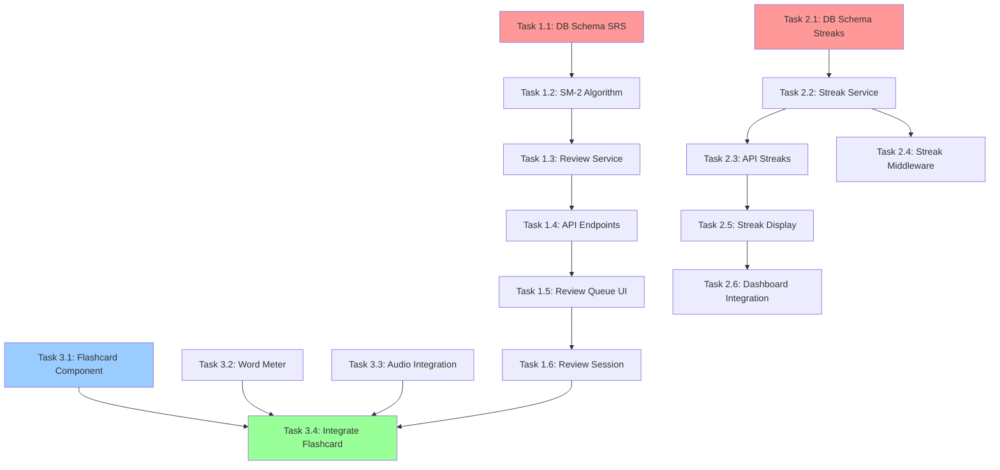

# EXECUTION PLAN: Vocabulary Phase 1 Quick Wins

**Date:** 2026-02-06  
**PM:** Fuchs Project Manager Agent  
**Phase:** 1 - Quick Wins (3 Features)  
**Duration:** 10 working days (2 weeks with buffer)

---

## 📋 **OVERVIEW**

**Based on:**
- `.research/RESEARCH_REPORT_vocabulary.md` - Research findings
- `DMF_VOCABULARY_ACTION_PLAN.md` - Feature specifications
- `.claude/rules/` - Development standards

**Goal:** Deliver 3 production-ready features:
1. ✅ SRS Algorithm (SM-2) implementation
2. ✅ Daily Streaks tracking
3. ✅ Enhanced Flashcard UI components

**Success Criteria:**
- [ ] All features deployed to localhost:3000
- [ ] >80% test coverage
- [ ] Code follows all .claude/rules
- [ ] Ready for Module Tester Team handoff

---

## 👥 **TEAM ASSIGNMENT**

| Role | Agent | Responsibility | Workload |
|------|-------|----------------|----------|
| **Database Specialist** | DB Agent | Schema design, migrations | 16 hours |
| **Backend Developer** | Backend Agent | API endpoints, SRS logic, services | 32 hours |
| **Frontend Developer** | Frontend Agent | React components, UI/UX | 28 hours |
| **QA Tester** | QA Agent | Integration tests, bug verification | 4 hours |

**Total Effort:** 80 hours (10 days × 1 developer OR 2.5 days × 3 parallel developers)

---

## 🎯 **FEATURE 1: SRS ALGORITHM IMPLEMENTATION**

### **Task 1.1: Database Schema Design** 
- **Owner:** Database Specialist
- **Effort:** 3 hours
- **Priority:** P0 (blocking)
- **Dependencies:** None

**Description:**  
Create `user_word_progress` table với SM-2 algorithm fields.

**Files to modify:**
- `services/learning-service/prisma/schema.prisma`

**Acceptance Criteria:**
- [ ] Table `user_word_progress` với fields:
  - `id` (UUID primary key)
  - `user_id` (foreign key to users)
  - `word_id` (foreign key to vocabulary_items)
  - `ease_factor` (float, default 2.5)
  - `interval_days` (int, default 1)
  - `repetitions` (int, default 0)
  - `next_review` (timestamp)
  - `status` (enum: 'new', 'learning', 'review', 'mastered')
  - `last_result` (boolean)
  - `total_reviews` (int, default 0)
  - `correct_reviews` (int, default 0)
  - `created_at`, `updated_at` (timestamps)
- [ ] Indexes added: `(user_id, next_review)`, `(word_id)`
- [ ] Unique constraint: `(user_id, word_id)`
- [ ] Migration tested locally

**Output:**
- `prisma/migrations/YYYYMMDD_add_user_word_progress/migration.sql`

---

### **Task 1.2: SM-2 Algorithm Implementation**
- **Owner:** Backend Developer
- **Effort:** 4 hours
- **Priority:** P0
- **Dependencies:** Task 1.1 complete

**Description:**  
Implement pure function tính toán next review date theo SM-2.

**Files to create:**
- `services/learning-service/src/lib/srs-algorithm.ts`

**Acceptance Criteria:**
- [ ] Function `calculateNextReview(quality, currentState)` implemented
- [ ] Quality score 0-5 mapping:
  - 0-2: Reset interval to 1, repetitions to 0 (fail)
  - 3: Hard (interval × 1.0)
  - 4: Good (interval × ease_factor)
  - 5: Easy (interval × ease_factor × 1.3)
- [ ] Ease factor updates correctly: EF' = EF + (0.1 - (5 - q) × (0.08 + (5 - q) × 0.02))
- [ ] Min ease factor clamped at 1.3
- [ ] Unit tests cover all quality scores (0-5)
- [ ] Edge cases tested: first review, streak breaks

**Output:**
- `src/lib/srs-algorithm.ts` (~100 LOC)
- `src/lib/__tests__/srs-algorithm.test.ts` (~200 LOC)

---

### **Task 1.3: Review Queue Service**
- **Owner:** Backend Developer  
- **Effort:** 4 hours
- **Priority:** P0
- **Dependencies:** Task 1.2

**Description:**  
Business logic service để fetch words due for review.

**Files to create:**
- `services/learning-service/src/services/reviewService.ts`

**Acceptance Criteria:**
- [ ] Function `getReviewQueue(userId)` returns:
  - Words where `next_review <= NOW()`
  - Sorted by `next_review` ASC (oldest first)
  - Includes word details (from vocabulary_items join)
  - Limited to 20 words per session
- [ ] Function `submitReview(userId, wordId, quality)`:
  - Validates quality score 0-5
  - Calls `calculateNextReview()`
  - Updates `user_word_progress` with new values
  - Returns updated progress state
- [ ] Function `getProgressStats(userId)` returns:
  - Total words: count grouped by status
  - Due today: count where next_review <= today
  - Accuracy: correct_reviews / total_reviews
- [ ] All functions have error handling (try-catch)

**Output:**
- `src/services/reviewService.ts` (~150 LOC)
- `src/services/__tests__/reviewService.test.ts` (~250 LOC)

---

### **Task 1.4: API Endpoints for SRS**
- **Owner:** Backend Developer
- **Effort:** 3 hours
- **Priority:** P0
- **Dependencies:** Task 1.3

**Description:**  
RESTful endpoints cho review flow.

**Files to modify:**
- `services/learning-service/src/api/review.routes.ts` (new)

**Acceptance Criteria:**
- [ ] `GET /api/review/queue` - Get review queue
  - Response: `{ success: true, data: { words: [...], count: 20 } }`
  - Auth required (JWT middleware)
- [ ] `POST /api/review/submit` - Submit review result
  - Body: `{ wordId: string, quality: number (0-5) }`
  - Validation: Zod schema
  - Response: `{ success: true, data: { nextReview: Date, interval: number } }`
- [ ] `GET /api/review/stats` - Get progress stats
  - Response: `{ success: true, data: { new: 100, learning: 50, review: 30, mastered: 20 } }`
- [ ] Error responses follow .claude/rules/api-backend.md format
- [ ] All endpoints logged with request ID

**Output:**
- `src/api/review.routes.ts` (~100 LOC)
- Integration tests: `src/api/__tests__/review.routes.test.ts` (~200 LOC)

---

### **Task 1.5: Frontend Review Queue UI**
- **Owner:** Frontend Developer
- **Effort:** 5 hours
- **Priority:** P0
- **Dependencies:** Task 1.4

**Description:**  
React component hiển thị words cần ôn tập.

**Files to create:**
- `apps/web-learner/src/components/vocabulary/ReviewQueue.tsx`
- `apps/web-learner/src/hooks/useReviewQueue.ts`

**Acceptance Criteria:**
- [ ] Component `<ReviewQueue>` shows:
  - Count: "20 words due for review"
  - List of words (card preview)
  - "Start Review" button
- [ ] Custom hook `useReviewQueue()`:
  - Fetches from `GET /api/review/queue`
  - React Query caching (staleTime: 30s)
  - Loading/error states handled
- [ ] Responsive: mobile + desktop layouts
- [ ] Loading skeleton while fetching
- [ ] Empty state: "No reviews due! Come back tomorrow 🎉"
- [ ] Follows .claude/rules/frontend-react.md (TypeScript, proper types)

**Output:**
- `ReviewQueue.tsx` (~120 LOC)
- `useReviewQueue.ts` (~50 LOC)
- `ReviewQueue.test.tsx` (~100 LOC)

---

### **Task 1.6: Review Session Flow**
- **Owner:** Frontend Developer
- **Effort:** 6 hours
- **Priority:** P0
- **Dependencies:** Task 1.5

**Description:**  
Full review session: flip cards, rate difficulty, show results.

**Files to create:**
- `apps/web-learner/src/app/vocabulary/review/page.tsx`
- `apps/web-learner/src/components/vocabulary/ReviewSession.tsx`

**Acceptance Criteria:**
- [ ] Page `/vocabulary/review` shows:
  - Current card (1 of 20)
  - Progress bar: [████░░░░░░] 40%
  - Front: German word + audio button
  - Flip button → Back: Vietnamese meaning + example
- [ ] Rating buttons (4 buttons):
  - "Again" (quality 1) - red, shortcut: 1
  - "Hard" (quality 3) - orange, shortcut: 2
  - "Good" (quality 4) - green, shortcut: 3
  - "Easy" (quality 5) - blue, shortcut: 4
- [ ] Click rating → API call → next card
- [ ] Session complete → Summary screen:
  - "20/20 reviewed ✅"
  - "Next review: X words tomorrow"
  - Button: "Back to Dashboard"
- [ ] Keyboard shortcuts work (1-4 keys)
- [ ] Mobile swipe gestures (optional P1)

**Output:**
- `page.tsx` (~80 LOC)
- `ReviewSession.tsx` (~200 LOC)
- Tests (~150 LOC)

---

## 🔥 **FEATURE 2: DAILY STREAKS TRACKING**

### **Task 2.1: Database Schema for Streaks**
- **Owner:** Database Specialist
- **Effort:** 1 hour
- **Priority:** P1
- **Dependencies:** None (parallel with Task 1.1)

**Description:**  
Add streak fields to `users` table.

**Files to modify:**
- `services/learning-service/prisma/schema.prisma`

**Acceptance Criteria:**
- [ ] Add to `User` model:
  - `current_streak` (int, default 0)
  - `longest_streak` (int, default 0)
  - `last_activity_date` (timestamp, nullable)
- [ ] Migration created and tested
- [ ] Seed script updated với sample data

**Output:**
- `prisma/migrations/YYYYMMDD_add_user_streaks/migration.sql`

---

### **Task 2.2: Streak Calculation Service**
- **Owner:** Backend Developer
- **Effort:** 3 hours
- **Priority:** P1
- **Dependencies:** Task 2.1

**Description:**  
Business logic để update streaks mỗi khi user học.

**Files to create:**
- `services/learning-service/src/services/streakService.ts`

**Acceptance Criteria:**
- [ ] Function `updateStreak(userId)`:
  - Get user's `last_activity_date`
  - Compare with today:
    - Same day: No change
    - Next day (yesterday): `current_streak++`
    - Missed days: Reset to 1
  - Update `longest_streak` if `current_streak` exceeds it
  - Set `last_activity_date` to today
  - Return new streak value
- [ ] Function `checkStreakMilestone(streak)`:
  - Returns achievement ID nếu đạt milestone: 7, 30, 100, 365 days
  - Returns null nếu không phải milestone
- [ ] Edge cases tested:
  - Timezone handling (use user's timezone)
  - Midnight boundary (activity at 23:59 vs 00:01)
  - First-time user (null last_activity_date)
- [ ] Unit tests coverage >90%

**Output:**
- `src/services/streakService.ts` (~80 LOC)
- `src/services/__tests__/streakService.test.ts` (~150 LOC)

---

### **Task 2.3: API Endpoint for Streaks**
- **Owner:** Backend Developer
- **Effort:** 2 hours
- **Priority:** P1
- **Dependencies:** Task 2.2

**Description:**  
Endpoint để frontend fetch streak info.

**Files to modify:**
- `services/learning-service/src/api/user.routes.ts` (add endpoint)

**Acceptance Criteria:**
- [ ] `GET /api/user/streak` returns:
  ```json
  {
    "success": true,
    "data": {
      "currentStreak": 15,
      "longestStreak": 30,
      "isActiveToday": true,
      "nextMilestone": 30,
      "daysUntilMilestone": 15
    }
  }
  ```
- [ ] Auth required (JWT)
- [ ] Error handling (user not found, DB errors)
- [ ] Logged với request ID

**Output:**
- Modified `src/api/user.routes.ts` (+30 LOC)
- Integration test (+50 LOC)

---

### **Task 2.4: Middleware to Auto-Update Streaks**
- **Owner:** Backend Developer
- **Effort:** 2 hours
- **Priority:** P1
- **Dependencies:** Task 2.2

**Description:**  
Middleware tự động update streak mỗi khi user submit review.

**Files to create:**
- `services/learning-service/src/middlewares/streakMiddleware.ts`

**Acceptance Criteria:**
- [ ] Middleware `updateStreakOnActivity`:
  - Runs after `POST /api/review/submit` succeeds
  - Calls `streakService.updateStreak(userId)`
  - If milestone reached → emit event (for achievements)
  - Does NOT block response (async background task)
- [ ] Error handling: Log errors but don't fail request
- [ ] Integration test: Submit review → verify streak incremented

**Output:**
- `src/middlewares/streakMiddleware.ts` (~40 LOC)
- Test (~60 LOC)

---

### **Task 2.5: Frontend Streak Display Component**
- **Owner:** Frontend Developer
- **Effort:** 4 hours
- **Priority:** P1
- **Dependencies:** Task 2.3

**Description:**  
Component hiển thị streak với flame icon animated.

**Files to create:**
- `apps/web-learner/src/components/gamification/StreakDisplay.tsx`
- `apps/web-learner/src/hooks/useStreak.ts`

**Acceptance Criteria:**
- [ ] Component `<StreakDisplay>` shows:
  - 🔥 Flame icon (animated pulse nếu active today)
  - Number: "15 day streak"
  - Progress to next milestone: [███░░] "15/30 days to Silver Badge"
- [ ] Hook `useStreak()`:
  - Fetches from `GET /api/user/streak`
  - React Query (staleTime: 5 minutes)
  - Refetch on window focus
- [ ] Animation:
  - Flame pulses when active (Framer Motion)
  - Celebratory confetti when milestone reached (react-confetti)
- [ ] Responsive: looks good on mobile + desktop
- [ ] TailwindCSS styling, follows design system

**Output:**
- `StreakDisplay.tsx` (~100 LOC)
- `useStreak.ts` (~40 LOC)
- Test (~80 LOC)

---

### **Task 2.6: Integrate Streak into Dashboard**
- **Owner:** Frontend Developer
- **Effort:** 2 hours
- **Priority:** P1
- **Dependencies:** Task 2.5

**Description:**  
Add StreakDisplay to main dashboard (top-right corner).

**Files to modify:**
- `apps/web-learner/src/app/dashboard/page.tsx`

**Acceptance Criteria:**
- [ ] `<StreakDisplay>` rendered in dashboard header
- [ ] Positioned: top-right, above other stats
- [ ] Click opens modal với:
  - Streak history calendar (last 30 days, green dots for active days)
  - Achievements unlocked
  - Encouragement message: "Keep it up!"
- [ ] Modal component: `<StreakDetailsModal>`
- [ ] Follows accessibility guidelines (WCAG 2.1)

**Output:**
- Modified `dashboard/page.tsx` (+20 LOC)
- `StreakDetailsModal.tsx` (~120 LOC)

---

## 🎴 **FEATURE 3: FLASHCARD UI COMPONENTS**

### **Task 3.1: Flashcard Base Component**
- **Owner:** Frontend Developer
- **Effort:** 4 hours
- **Priority:** P0
- **Dependencies:** None

**Description:**  
Reusable flashcard với flip animation.

**Files to create:**
- `apps/web-learner/src/components/vocabulary/Flashcard.tsx`
- `apps/web-learner/src/components/vocabulary/FlashcardFront.tsx`
- `apps/web-learner/src/components/vocabulary/FlashcardBack.tsx`

**Acceptance Criteria:**
- [ ] `<Flashcard>` component:
  - Props: `word` object, `isFlipped` boolean, `onFlip` callback
  - 3D flip animation (CSS transform or Framer Motion)
  - Smooth 60fps animation (verified in Chrome DevTools)
- [ ] `<FlashcardFront>`:
  - Shows: German word (large font)
  - Audio button 🔊 (calls TTS API)
  - Level badge (A1, A2, etc.)
  - Word type badge (noun, verb, adj)
- [ ] `<FlashcardBack>`:
  - Shows: Vietnamese meaning
  - Example sentence (German + Vietnamese)
  - "Flip back" button or auto-flip on timer
- [ ] Responsive: 
  - Mobile: 90vw width
  - Desktop: 600px max-width
  - Height: auto, min 400px
- [ ] Accessibility:
  - Keyboard: Space to flip
  - Screen reader announces front/back content
  - Focus visible

**Output:**
- `Flashcard.tsx` (~150 LOC)
- `FlashcardFront.tsx` (~80 LOC)
- `FlashcardBack.tsx` (~100 LOC)
- Tests (~200 LOC combined)

---

### **Task 3.2: Word Meter Component**
- **Owner:** Frontend Developer
- **Effort:** 3 hours
- **Priority:** P1
- **Dependencies:** None (parallel)

**Description:**  
Visual progress indicator cho word mastery.

**Files to create:**
- `apps/web-learner/src/components/vocabulary/WordMeter.tsx`

**Acceptance Criteria:**
- [ ] Component `<WordMeter>`:
  - Props: `status` ('new', 'learning', 'review', 'mastered'), `accuracy` (0-1)
  - Visual: Horizontal bar với 5 stages:
    ```
    [New] → [Learning] → [Review] → [Nearly There] → [Mastered]
    ```
  - Color coding:
    - New: gray
    - Learning: yellow
    - Review: orange
    - Nearly There: light green
    - Mastered: dark green
  - Animated fill (CSS transition)
- [ ] Tooltip on hover: "Reviewed X times, Y% accuracy"
- [ ] Responsive: works on mobile (touch-friendly)
- [ ] TailwindCSS only (no external libs)

**Output:**
- `WordMeter.tsx` (~80 LOC)
- Test (~60 LOC)

---

### **Task 3.3: Audio Player Integration**
- **Owner:** Backend Developer (API) + Frontend Developer (UI)
- **Effort:** 4 hours (2h backend, 2h frontend)
- **Priority:** P1
- **Dependencies:** Task 3.1

**Description:**  
Integrate Google Cloud TTS API cho audio pronunciation.

**Backend (2h):**

**Files:**
- `services/learning-service/src/services/ttsService.ts`
- `services/learning-service/src/api/audio.routes.ts`

**Acceptance Criteria (Backend):**
- [ ] Service `ttsService.generateAudio(text, language='de-DE')`:
  - Calls Google Cloud TTS API
  - Caches audio URL trong database (`vocabulary_items.audio_url`)
  - Returns audio URL (MP3 format)
- [ ] Endpoint `GET /api/audio/:wordId`:
  - Returns audio URL từ cache (if exists)
  - OR generates on-demand (first request)
  - Response: `{ success: true, data: { audioUrl: "https://..." } }`
- [ ] Error handling: TTS API failures, rate limits
- [ ] Environment variable: `GOOGLE_TTS_API_KEY` required

**Frontend (2h):**

**Files:**
- `apps/web-learner/src/hooks/useAudio.ts`
- Modify `FlashcardFront.tsx`

**Acceptance Criteria (Frontend):**
- [ ] Hook `useAudio(wordId)`:
  - Fetches audio URL from `GET /api/audio/:wordId`
  - Plays audio using Howler.js
  - Loading state while fetching
  - Error handling (show toast if fails)
- [ ] Audio button in `<FlashcardFront>`:
  - Click → plays audio
  - Shows loading spinner while fetching
  - Disabled state if error
  - Icon changes: 🔊 (ready) → ⏸️ (playing) → 🔊 (done)
- [ ] Auto-play option (user preference, default off)

**Output:**
- Backend: `ttsService.ts` (~100 LOC), `audio.routes.ts` (~50 LOC)
- Frontend: `useAudio.ts` (~60 LOC), modified `FlashcardFront.tsx` (+30 LOC)
- Tests: ~200 LOC combined

---

### **Task 3.4: Integrate Flashcard into Review Session**
- **Owner:** Frontend Developer
- **Effort:** 2 hours
- **Priority:** P0
- **Dependencies:** Task 3.1, Task 3.2, Task 1.6

**Description:**  
Replace placeholder cards in ReviewSession với new Flashcard component.

**Files to modify:**
- `apps/web-learner/src/components/vocabulary/ReviewSession.tsx`

**Acceptance Criteria:**
- [ ] Use `<Flashcard>` instead of basic div
- [ ] Show `<WordMeter>` below flashcard
- [ ] Audio button works (integrated from Task 3.3)
- [ ] Flip animation plays on button click OR auto after 3s
- [ ] All keyboard shortcuts still work
- [ ] No visual bugs (spacing, alignment)
- [ ] Performance: No jank during animation (measure FPS)

**Output:**
- Modified `ReviewSession.tsx` (~50 LOC changes)
- Updated tests (~30 LOC)

---

## 📅 **TIMELINE & DEPENDENCIES**

### **Week 1 (Days 1-5):**

**Day 1-2:**
- Task 1.1 (DB Schema - SRS) → 3h
- Task 1.2 (SM-2 Algorithm) → 4h
- Task 1.3 (Review Service) → 4h
- Task 2.1 (DB Schema - Streaks) → 1h *(parallel)*
- **Total:** 12h (1.5 days)

**Day 3:**
- Task 1.4 (API Endpoints - SRS) → 3h
- Task 2.2 (Streak Service) → 3h
- Task 3.1 (Flashcard Component) → 4h *(parallel)*
- **Total:** 10h

**Day 4-5:**
- Task 1.5 (Review Queue UI) → 5h
- Task 1.6 (Review Session) → 6h
- Task 2.3 (API - Streaks) → 2h *(parallel)*
- Task 2.4 (Streak Middleware) → 2h *(parallel)*
- **Total:** 15h (2 days)

### **Week 2 (Days 6-10):**

**Day 6-7:**
- Task 2.5 (Streak Display) → 4h
- Task 2.6 (Dashboard Integration) → 2h
- Task 3.2 (Word Meter) → 3h *(parallel)*
- Task 3.3 (Audio Integration) → 4h *(parallel)*
- **Total:** 13h (1.5 days)

**Day 8:**
- Task 3.4 (Integrate Flashcard) → 2h
- **Integration Testing** → 4h
- **Bug Fixes** → 2h
- **Total:** 8h

**Day 9-10:**
- **QA Testing** → 4h
- **Code Review** → 2h
- **Documentation** → 2h
- **Final Polish** → 4h
- **Total:** 12h (1.5 days)

**Grand Total:** ~70 hours (10 days with buffer)

---

## 🔗 **DEPENDENCY GRAPH**



**Critical Path:** T1.1 → T1.2 → T1.3 → T1.4 → T1.5 → T1.6 → T3.4 (30 hours)

---

## 📊 **RISK ASSESSMENT**

### **High Risk (🔴 Mitigation Required):**

| Risk | Impact | Probability | Mitigation |
|------|--------|-------------|------------|
| **Google TTS API key not available** | Blocks Task 3.3 (audio) | Medium | Use fallback: Amazon Polly (free tier) OR mock audio for MVP |
| **Framer Motion bundle size too large** | Performance issues | Low | Use CSS animations instead (lighter) |
| **SM-2 algorithm bugs** | Wrong review dates | Medium | Extensive unit tests + manual verification with known datasets |

### **Medium Risk (🟡 Monitor):**

| Risk | Impact | Probability | Mitigation |
|------|--------|-------------|------------|
| **Timezone handling edge cases** | Streak bugs at midnight | Medium | Use UTC internally, convert to user timezone only for display |
| **Database migration conflicts** | Deployment issues | Low | Test migrations on staging DB first |
| **React Query caching issues** | Stale data shown | Low | Set appropriate `staleTime` values, add manual refetch buttons |

### **Low Risk (🟢 Accept):**

| Risk | Impact | Probability | Mitigation |
|------|--------|-------------|------------|
| **Confetti animation performance** | Laggy on old phones | Low | Disable on low-end devices (check navigator.hardwareConcurrency) |
| **Audio playback browser compatibility** | Doesn't work on old Safari | Very Low | Howler.js handles fallbacks automatically |

---

## ✅ **DEFINITION OF DONE**

Before marking a task complete:

### **Code Quality:**
- [ ] Follows all rules in `.claude/rules/` (api-backend.md, frontend-react.md, database-prisma.md)
- [ ] TypeScript: No `any` types (unless explicitly justified)
- [ ] ESLint: No warnings or errors
- [ ] Prettier: Code formatted

### **Testing:**
- [ ] Unit tests written (>80% coverage)
- [ ] Integration tests for API endpoints
- [ ] Component tests for UI (React Testing Library)
- [ ] All tests passing (`pnpm test`)

### **Documentation:**
- [ ] JSDoc comments for public functions
- [ ] Vietnamese comments for complex logic
- [ ] README updated nếu có public API changes

### **Performance:**
- [ ] Lighthouse score >90 (performance)
- [ ] No console errors/warnings
- [ ] Bundle size check (no >100KB additions)

### **Accessibility:**
- [ ] Keyboard navigation works
- [ ] Screen reader tested (VoiceOver/NVDA)
- [ ] Color contrast meets WCAG AA

### **Review:**
- [ ] Code reviewed by Tech Lead
- [ ] PM approved (matches acceptance criteria)
- [ ] QA tested on localhost

---

## 📦 **DELIVERABLES**

### **Week 1 End:**
- ✅ SRS Algorithm fully functional (backend + database)
- ✅ Review Queue API working
- ✅ Basic flashcard UI rendering

### **Week 2 End:**
- ✅ Daily Streaks fully integrated
- ✅ Enhanced Flashcard với audio + animations
- ✅ All features on localhost:3000
- ✅ Test suite passing (>80% coverage)
- ✅ Documentation complete

### **Handoff to QA:**
- ✅ Deployment guide: How to run locally
- ✅ Test scenarios document
- ✅ Known issues list (if any)
- ✅ Demo video (optional but recommended)

---

## 🎉 **SUCCESS METRICS**

**Post-deployment (measure after 1 week):**

| Metric | Baseline | Target | Measurement Method |
|--------|----------|--------|-------------------|
| **Review Completion Rate** | 50% | 80% | % users completing daily review queue |
| **Avg Session Duration** | 8 min | 12 min | Google Analytics / Mixpanel |
| **Streak Retention (D7)** | 40% | 60% | % users with 7+ day streak |
| **Audio Play Rate** | N/A | 70% | % flashcards with audio played |
| **User Satisfaction** | N/A | 4.5/5 | In-app survey after 10 reviews |

---

## 📞 **ESCALATION PROCESS**

### **When to escalate to PM (me):**

- ⏰ Task takes >50% longer than estimate (e.g., 6h task hits 9h)
- 🚫 Critical blocker >4 hours (e.g., API key issue, DB migration failure)
- 🔀 Scope creep detected (requirements unclear, new features requested)
- 🐛 Critical bug found in production-like environment

### **How to escalate:**

```
📢 ESCALATION: [Task ID] - [Brief Issue]

**Task:** Task 1.3 (Review Service)
**Owner:** Backend Agent
**Issue:** Prisma query performance <100ms requirement impossible với current DB indexes
**Tried:**
- Added composite index (user_id, next_review)
- Query still ~200ms với 10K records
**Need Decision:**
- Option A: Accept 200ms (still acceptable UX)
- Option B: Implement caching layer (+2 days effort)
- Option C: Pagination (only fetch 20 words, not full queue)
**Recommend:** Option C (quick fix, no perf impact)
```

---

## 🏁 **NEXT STEPS AFTER PHASE 1**

**If successful (all features delivered on time):**

1. **QA Testing** (2-3 days) - Module Tester Team takes over
2. **User Acceptance Testing** (1 week) - Internal beta testers
3. **Deployment to Staging** → Production
4. **Phase 2 Planning** (Family Words, Advanced Stats)

**If delayed or blockers:**

1. **Prioritize P0 tasks** (SRS + Flashcard UI)
2. **Defer P1 tasks** (Streaks can wait)
3. **Re-estimate and adjust timeline**

---

**Plan Status:** ✅ READY FOR EXECUTION  
**Approved by:** Fuchs PM Agent  
**Date:** 2026-02-06  
**Next Action:** Spawn Tech Lead to review this plan and spawn developers

---

**Appendix:**
- Research: `.research/RESEARCH_REPORT_vocabulary.md`
- Action Plan: `DMF_VOCABULARY_ACTION_PLAN.md`
- Development Rules: `.claude/rules/`
