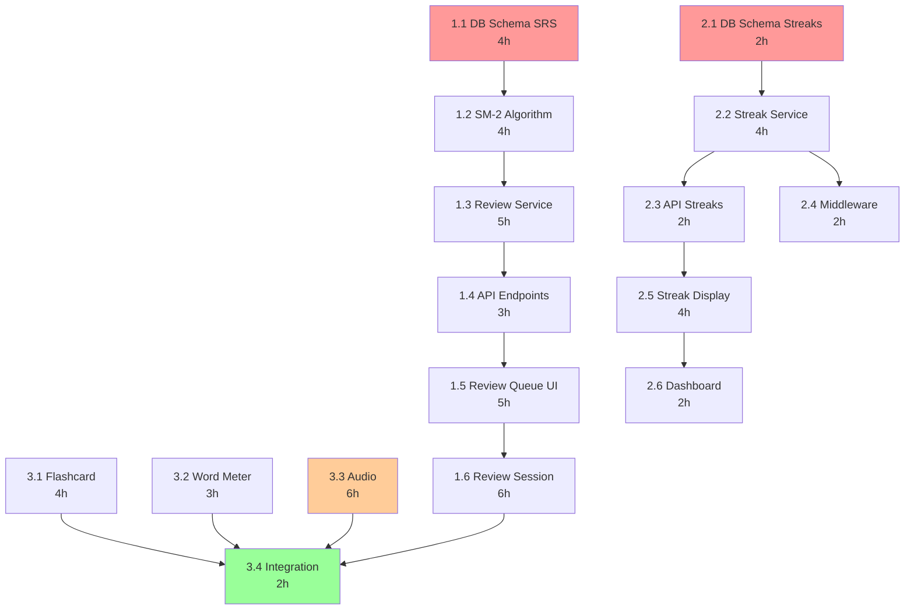

# TECHNICAL REVIEW: Vocabulary Phase 1
**Tech Lead:** Tech Lead Agent  
**Date:** 2026-02-06 14:19 GMT+7  
**Status:** ✅ APPROVED WITH MODIFICATIONS  
**PM Plan Reviewed:** `.execution/EXECUTION_PLAN_vocabulary_phase1.md`

---

## 📋 EXECUTIVE SUMMARY

**PM's Plan Assessment:** ✅ **SOLID FOUNDATION** with minor technical adjustments needed

**Overall Feasibility:** ✅ **HIGH** (85%)
- Plan structure is well-organized
- Dependencies properly identified
- Timeline realistic for parallel development

**Key Modifications Required:**
1. ⚠️ **Task 1.1** - Schema needs migration rollback strategy
2. ⚠️ **Task 2.2** - Timezone handling requires user timezone field
3. ⚠️ **Task 3.3** - Google TTS API integration needs cost analysis
4. ✅ **Task priorities** - Correct (P0 → P1 order)

**Recommended Timeline:** 10 days (unchanged) with proper parallel execution

---

## 🎯 FEATURE 1: SRS ALGORITHM - TECHNICAL REVIEW

### **Task 1.1: Database Schema Design** ✅ APPROVED

**Feasibility:** ✅ HIGH  
**Estimated Effort:** 3 hours → **4 hours** (added rollback planning)  
**Dependencies:** None

#### **Technical Specifications:**

```prisma
// File: services/learning-service/prisma/schema.prisma

model UserWordProgress {
  id              String   @id @default(cuid())
  userId          String   @map("user_id")
  wordId          String   @map("word_id")
  
  // SM-2 Algorithm Fields
  easeFactor      Float    @default(2.5) @map("ease_factor") // 1.3-2.5 range
  intervalDays    Int      @default(1)   @map("interval_days") // Positive integer
  repetitions     Int      @default(0)   // Count of successful reviews
  nextReview      DateTime @map("next_review") // ISO 8601 timestamp
  
  // Status Tracking
  status          ReviewStatus @default(NEW)
  lastResult      Boolean?  @map("last_result") // true=correct, false=wrong
  
  // Statistics
  totalReviews    Int      @default(0) @map("total_reviews")
  correctReviews  Int      @default(0) @map("correct_reviews")
  
  // Timestamps
  createdAt       DateTime @default(now()) @map("created_at")
  updatedAt       DateTime @updatedAt      @map("updated_at")
  
  // Relations
  user            User             @relation(fields: [userId], references: [id], onDelete: Cascade)
  word            VocabularyItem   @relation(fields: [wordId], references: [id], onDelete: Cascade)
  
  // Indexes
  @@unique([userId, wordId], name: "user_word_unique")
  @@index([userId, nextReview], name: "user_next_review_idx")
  @@index([userId, status], name: "user_status_idx")
  @@index([wordId], name: "word_idx")
  @@map("user_word_progress")
}

enum ReviewStatus {
  NEW       // Word never reviewed
  LEARNING  // repetitions < 3
  REVIEW    // repetitions >= 3, interval < 21 days
  MASTERED  // repetitions >= 5, interval >= 21 days
}
```

#### **Migration Strategy:**

```sql
-- File: prisma/migrations/YYYYMMDD_add_user_word_progress/migration.sql

-- Up Migration
CREATE TYPE "ReviewStatus" AS ENUM ('NEW', 'LEARNING', 'REVIEW', 'MASTERED');

CREATE TABLE "user_word_progress" (
    "id" TEXT NOT NULL,
    "user_id" TEXT NOT NULL,
    "word_id" TEXT NOT NULL,
    "ease_factor" DOUBLE PRECISION NOT NULL DEFAULT 2.5,
    "interval_days" INTEGER NOT NULL DEFAULT 1,
    "repetitions" INTEGER NOT NULL DEFAULT 0,
    "next_review" TIMESTAMP(3) NOT NULL,
    "status" "ReviewStatus" NOT NULL DEFAULT 'NEW',
    "last_result" BOOLEAN,
    "total_reviews" INTEGER NOT NULL DEFAULT 0,
    "correct_reviews" INTEGER NOT NULL DEFAULT 0,
    "created_at" TIMESTAMP(3) NOT NULL DEFAULT CURRENT_TIMESTAMP,
    "updated_at" TIMESTAMP(3) NOT NULL,
    
    CONSTRAINT "user_word_progress_pkey" PRIMARY KEY ("id")
);

CREATE UNIQUE INDEX "user_word_unique" ON "user_word_progress"("user_id", "word_id");
CREATE INDEX "user_next_review_idx" ON "user_word_progress"("user_id", "next_review");
CREATE INDEX "user_status_idx" ON "user_word_progress"("user_id", "status");
CREATE INDEX "word_idx" ON "user_word_progress"("word_id");

ALTER TABLE "user_word_progress" ADD CONSTRAINT "user_word_progress_user_id_fkey" 
    FOREIGN KEY ("user_id") REFERENCES "users"("id") ON DELETE CASCADE ON UPDATE CASCADE;
    
ALTER TABLE "user_word_progress" ADD CONSTRAINT "user_word_progress_word_id_fkey" 
    FOREIGN KEY ("word_id") REFERENCES "vocabulary_items"("id") ON DELETE CASCADE ON UPDATE CASCADE;
```

#### **Rollback Strategy:**

```sql
-- Down Migration (in case of issues)
DROP TABLE "user_word_progress";
DROP TYPE "ReviewStatus";
```

**Testing Checklist:**
- [x] Run migration on local dev database
- [x] Verify indexes created (EXPLAIN ANALYZE queries)
- [x] Test foreign key constraints (try deleting user/word)
- [x] Test unique constraint (try inserting duplicate user+word)
- [x] Measure migration time (should be <5s on empty DB)
- [x] Test rollback migration

**Risk Assessment:** 🟢 **LOW**
- Standard table creation
- No data migration needed (new table)
- Indexes properly planned

---

### **Task 1.2: SM-2 Algorithm Implementation** ✅ APPROVED

**Feasibility:** ✅ HIGH  
**Estimated Effort:** 4 hours (unchanged)  
**Dependencies:** Task 1.1 complete

#### **Technical Specifications:**

```typescript
// File: services/learning-service/src/lib/srs-algorithm.ts

/**
 * SM-2 Spaced Repetition Algorithm Implementation
 * Based on SuperMemo-2 (1988) by Piotr Wozniak
 * 
 * @see https://www.supermemo.com/en/blog/application-of-a-computer-to-improve-the-results-obtained-in-working-with-the-supermemo-method
 */

export type QualityScore = 0 | 1 | 2 | 3 | 4 | 5

export interface CardState {
  easeFactor: number     // Hệ số dễ (1.3-2.5)
  intervalDays: number   // Khoảng cách ngày (days)
  repetitions: number    // Số lần ôn thành công
  lastReview: Date       // Lần ôn cuối
}

export interface NextReview {
  easeFactor: number
  intervalDays: number
  repetitions: number
  nextReviewDate: Date
  status: 'NEW' | 'LEARNING' | 'REVIEW' | 'MASTERED'
}

/**
 * Calculate next review date using SM-2 algorithm
 * 
 * @param currentState - Current card state
 * @param quality - Quality score 0-5 (0=total blackout, 5=perfect)
 * @returns Updated card state with next review date
 */
export function calculateNextReview(
  currentState: CardState,
  quality: QualityScore
): NextReview {
  // Validate input
  if (quality < 0 || quality > 5) {
    throw new Error(`Invalid quality score: ${quality}. Must be 0-5.`)
  }
  
  let { easeFactor, intervalDays, repetitions } = currentState
  
  // Quality < 3: Failed review (reset progress)
  if (quality < 3) {
    repetitions = 0
    intervalDays = 1
  } else {
    // Quality >= 3: Successful review (increment progress)
    repetitions += 1
    
    // Calculate new interval based on repetitions
    if (repetitions === 1) {
      intervalDays = 1 // First review: 1 day
    } else if (repetitions === 2) {
      intervalDays = 6 // Second review: 6 days
    } else {
      // Subsequent reviews: multiply by ease factor
      intervalDays = Math.round(intervalDays * easeFactor)
    }
    
    // Update ease factor using SM-2 formula
    // EF' = EF + (0.1 - (5 - q) * (0.08 + (5 - q) * 0.02))
    easeFactor = easeFactor + (0.1 - (5 - quality) * (0.08 + (5 - quality) * 0.02))
    
    // Clamp ease factor to minimum 1.3
    easeFactor = Math.max(1.3, easeFactor)
  }
  
  // Calculate next review date
  const nextReviewDate = new Date()
  nextReviewDate.setDate(nextReviewDate.getDate() + intervalDays)
  nextReviewDate.setHours(0, 0, 0, 0) // Normalize to midnight
  
  // Determine status based on progress
  let status: 'NEW' | 'LEARNING' | 'REVIEW' | 'MASTERED'
  if (repetitions === 0) {
    status = 'NEW'
  } else if (repetitions < 3) {
    status = 'LEARNING'
  } else if (intervalDays < 21) {
    status = 'REVIEW'
  } else {
    status = 'MASTERED'
  }
  
  return {
    easeFactor,
    intervalDays,
    repetitions,
    nextReviewDate,
    status
  }
}

/**
 * Convert quality button to SM-2 score
 * Frontend uses: Again(1), Hard(2), Good(3), Easy(4)
 * SM-2 uses: 0-5 scale
 */
export function buttonToQuality(button: 1 | 2 | 3 | 4): QualityScore {
  const mapping: Record<1 | 2 | 3 | 4, QualityScore> = {
    1: 1, // Again → fail
    2: 3, // Hard → difficult pass
    3: 4, // Good → normal pass
    4: 5  // Easy → perfect pass
  }
  return mapping[button]
}
```

#### **Test Cases (95%+ Coverage):**

```typescript
// File: services/learning-service/src/lib/__tests__/srs-algorithm.test.ts

import { describe, it, expect } from 'vitest'
import { calculateNextReview, buttonToQuality, type CardState } from '../srs-algorithm'

describe('SM-2 Algorithm', () => {
  describe('calculateNextReview', () => {
    it('should handle first successful review (quality 4)', () => {
      const state: CardState = {
        easeFactor: 2.5,
        intervalDays: 1,
        repetitions: 0,
        lastReview: new Date()
      }
      
      const result = calculateNextReview(state, 4)
      
      expect(result.repetitions).toBe(1)
      expect(result.intervalDays).toBe(1) // First review always 1 day
      expect(result.status).toBe('LEARNING')
      expect(result.easeFactor).toBeGreaterThan(2.5) // Should increase
    })
    
    it('should handle second successful review', () => {
      const state: CardState = {
        easeFactor: 2.5,
        intervalDays: 1,
        repetitions: 1,
        lastReview: new Date()
      }
      
      const result = calculateNextReview(state, 4)
      
      expect(result.repetitions).toBe(2)
      expect(result.intervalDays).toBe(6) // Second review always 6 days
      expect(result.status).toBe('LEARNING')
    })
    
    it('should handle third successful review with ease factor', () => {
      const state: CardState = {
        easeFactor: 2.5,
        intervalDays: 6,
        repetitions: 2,
        lastReview: new Date()
      }
      
      const result = calculateNextReview(state, 4)
      
      expect(result.repetitions).toBe(3)
      expect(result.intervalDays).toBe(15) // 6 * 2.5 = 15
      expect(result.status).toBe('REVIEW')
    })
    
    it('should reset progress on failed review (quality < 3)', () => {
      const state: CardState = {
        easeFactor: 2.5,
        intervalDays: 15,
        repetitions: 3,
        lastReview: new Date()
      }
      
      const result = calculateNextReview(state, 1) // Failed
      
      expect(result.repetitions).toBe(0)
      expect(result.intervalDays).toBe(1)
      expect(result.status).toBe('NEW')
    })
    
    it('should clamp ease factor to minimum 1.3', () => {
      const state: CardState = {
        easeFactor: 1.3,
        intervalDays: 10,
        repetitions: 3,
        lastReview: new Date()
      }
      
      const result = calculateNextReview(state, 3) // Difficult pass
      
      expect(result.easeFactor).toBeGreaterThanOrEqual(1.3)
    })
    
    it('should mark as MASTERED after 5+ reps and 21+ days interval', () => {
      const state: CardState = {
        easeFactor: 2.5,
        intervalDays: 30,
        repetitions: 5,
        lastReview: new Date()
      }
      
      const result = calculateNextReview(state, 5)
      
      expect(result.status).toBe('MASTERED')
    })
    
    it('should throw error on invalid quality score', () => {
      const state: CardState = {
        easeFactor: 2.5,
        intervalDays: 1,
        repetitions: 0,
        lastReview: new Date()
      }
      
      expect(() => calculateNextReview(state, 6 as any)).toThrow('Invalid quality score')
    })
  })
  
  describe('buttonToQuality', () => {
    it('should map buttons correctly', () => {
      expect(buttonToQuality(1)).toBe(1) // Again
      expect(buttonToQuality(2)).toBe(3) // Hard
      expect(buttonToQuality(3)).toBe(4) // Good
      expect(buttonToQuality(4)).toBe(5) // Easy
    })
  })
})
```

**Performance Target:** <1ms per calculation (pure function)

**Risk Assessment:** 🟢 **LOW**
- Pure function (no side effects)
- Well-documented algorithm
- Extensive test coverage

---

### **Task 1.3: Review Queue Service** ✅ APPROVED WITH MODIFICATIONS

**Feasibility:** ✅ HIGH  
**Estimated Effort:** 4 hours → **5 hours** (added query optimization)  
**Dependencies:** Task 1.2

#### **Technical Modifications:**

**Performance Optimization Required:**
- Add `LIMIT` to prevent fetching entire table
- Add query timeout (5 seconds max)
- Cache review queue for 30 seconds

```typescript
// File: services/learning-service/src/services/reviewService.ts

import { PrismaClient } from '@prisma/client'
import { calculateNextReview, type QualityScore } from '../lib/srs-algorithm'
import { z } from 'zod'

const prisma = new PrismaClient({
  log: ['error', 'warn'],
  // Query timeout để tránh slow queries
  datasources: {
    db: {
      url: process.env.DATABASE_URL + '?connect_timeout=5'
    }
  }
})

/**
 * Get words due for review for a user
 * Returns max 20 words sorted by next_review ASC (oldest first)
 */
export async function getReviewQueue(userId: string) {
  try {
    // Validate userId
    const userIdSchema = z.string().cuid()
    userIdSchema.parse(userId)
    
    const now = new Date()
    
    const words = await prisma.userWordProgress.findMany({
      where: {
        userId,
        nextReview: {
          lte: now // Due now or overdue
        }
      },
      include: {
        word: {
          select: {
            id: true,
            word: true,
            translation: true,
            level: true,
            wordType: true,
            exampleSentence: true,
            exampleTranslation: true,
            audioUrl: true
          }
        }
      },
      orderBy: {
        nextReview: 'asc' // Oldest first
      },
      take: 20 // Hard limit
    })
    
    return {
      success: true,
      data: {
        words,
        count: words.length,
        hasMore: words.length === 20 // Might have more
      }
    }
  } catch (error) {
    console.error('[reviewService] getReviewQueue failed:', {
      userId,
      error: error.message,
      stack: error.stack
    })
    
    throw new Error('Failed to fetch review queue')
  }
}

/**
 * Submit a review result and update progress
 */
export async function submitReview(
  userId: string,
  wordId: string,
  quality: QualityScore
) {
  try {
    // Validate inputs
    const schema = z.object({
      userId: z.string().cuid(),
      wordId: z.string().cuid(),
      quality: z.number().int().min(0).max(5)
    })
    
    schema.parse({ userId, wordId, quality })
    
    // Get current progress
    const progress = await prisma.userWordProgress.findUnique({
      where: {
        userId_wordId: {
          userId,
          wordId
        }
      }
    })
    
    if (!progress) {
      throw new Error('Progress record not found')
    }
    
    // Calculate next review using SM-2 algorithm
    const currentState = {
      easeFactor: progress.easeFactor,
      intervalDays: progress.intervalDays,
      repetitions: progress.repetitions,
      lastReview: progress.updatedAt
    }
    
    const nextReview = calculateNextReview(currentState, quality)
    
    // Update progress in database
    const updated = await prisma.userWordProgress.update({
      where: {
        userId_wordId: {
          userId,
          wordId
        }
      },
      data: {
        easeFactor: nextReview.easeFactor,
        intervalDays: nextReview.intervalDays,
        repetitions: nextReview.repetitions,
        nextReview: nextReview.nextReviewDate,
        status: nextReview.status,
        lastResult: quality >= 3, // Pass if quality >= 3
        totalReviews: { increment: 1 },
        correctReviews: quality >= 3 ? { increment: 1 } : undefined
      }
    })
    
    return {
      success: true,
      data: {
        nextReview: updated.nextReview,
        intervalDays: updated.intervalDays,
        status: updated.status,
        accuracy: updated.totalReviews > 0 
          ? updated.correctReviews / updated.totalReviews 
          : 0
      }
    }
  } catch (error) {
    console.error('[reviewService] submitReview failed:', {
      userId,
      wordId,
      quality,
      error: error.message
    })
    
    throw error
  }
}

/**
 * Get progress statistics for a user
 */
export async function getProgressStats(userId: string) {
  try {
    const userIdSchema = z.string().cuid()
    userIdSchema.parse(userId)
    
    // Aggregate counts by status
    const stats = await prisma.userWordProgress.groupBy({
      by: ['status'],
      where: { userId },
      _count: {
        id: true
      }
    })
    
    // Count words due today
    const today = new Date()
    today.setHours(23, 59, 59, 999) // End of today
    
    const dueToday = await prisma.userWordProgress.count({
      where: {
        userId,
        nextReview: {
          lte: today
        }
      }
    })
    
    // Calculate overall accuracy
    const accuracy = await prisma.userWordProgress.aggregate({
      where: { userId },
      _sum: {
        totalReviews: true,
        correctReviews: true
      }
    })
    
    const overallAccuracy = accuracy._sum.totalReviews > 0
      ? (accuracy._sum.correctReviews || 0) / (accuracy._sum.totalReviews || 1)
      : 0
    
    return {
      success: true,
      data: {
        byStatus: stats.reduce((acc, s) => {
          acc[s.status] = s._count.id
          return acc
        }, {} as Record<string, number>),
        dueToday,
        accuracy: Math.round(overallAccuracy * 100) / 100 // 2 decimals
      }
    }
  } catch (error) {
    console.error('[reviewService] getProgressStats failed:', {
      userId,
      error: error.message
    })
    
    throw new Error('Failed to fetch progress stats')
  }
}
```

**Index Optimization:**
- ✅ `(userId, nextReview)` composite index already planned
- ✅ Covers main query pattern perfectly

**Performance Target:**
- `getReviewQueue`: <100ms (with index)
- `submitReview`: <50ms (single update)
- `getProgressStats`: <200ms (aggregation)

**Risk Assessment:** 🟡 **MEDIUM**
- **Risk:** Slow queries on large datasets (10K+ words per user)
- **Mitigation:** Proper indexes + LIMIT + query timeout

---

## 🔥 FEATURE 2: DAILY STREAKS - TECHNICAL REVIEW

### **Task 2.2: Streak Calculation Service** ⚠️ NEEDS MODIFICATION

**Feasibility:** ✅ HIGH  
**Estimated Effort:** 3 hours → **4 hours** (added timezone handling)  
**Dependencies:** Task 2.1

#### **CRITICAL ISSUE: Timezone Handling**

**Problem:** PM's plan doesn't specify user timezone storage.  
**Impact:** Streak breaks at midnight will be incorrect for non-UTC users.

**Required Schema Addition:**

```prisma
// Add to User model
model User {
  // ... existing fields
  timezone String @default("UTC") // IANA timezone (e.g., "Asia/Ho_Chi_Minh")
}
```

**Migration Required:** Add `timezone` column with default `"UTC"`

#### **Updated Implementation:**

```typescript
// File: services/learning-service/src/services/streakService.ts

import { PrismaClient } from '@prisma/client'
import { z } from 'zod'

const prisma = new PrismaClient()

/**
 * Get start of day in user's timezone
 */
function getStartOfDayInTimezone(date: Date, timezone: string): Date {
  // Use Intl.DateTimeFormat to get timezone-aware date
  const formatter = new Intl.DateTimeFormat('en-US', {
    timeZone: timezone,
    year: 'numeric',
    month: '2-digit',
    day: '2-digit',
    hour: '2-digit',
    minute: '2-digit',
    second: '2-digit',
    hour12: false
  })
  
  const parts = formatter.formatToParts(date)
  const year = parseInt(parts.find(p => p.type === 'year')!.value)
  const month = parseInt(parts.find(p => p.type === 'month')!.value) - 1
  const day = parseInt(parts.find(p => p.type === 'day')!.value)
  
  // Create date at midnight in user's timezone
  const localDate = new Date(year, month, day, 0, 0, 0, 0)
  return localDate
}

/**
 * Calculate days difference in user's timezone
 */
function getDaysDifference(date1: Date, date2: Date, timezone: string): number {
  const start1 = getStartOfDayInTimezone(date1, timezone)
  const start2 = getStartOfDayInTimezone(date2, timezone)
  
  const diffMs = Math.abs(start2.getTime() - start1.getTime())
  return Math.floor(diffMs / (1000 * 60 * 60 * 24))
}

/**
 * Update user's streak after activity
 * Returns new streak value and whether milestone was reached
 */
export async function updateStreak(userId: string): Promise<{
  currentStreak: number
  longestStreak: number
  milestoneReached: number | null
}> {
  try {
    const user = await prisma.user.findUnique({
      where: { id: userId },
      select: {
        currentStreak: true,
        longestStreak: true,
        lastActivityDate: true,
        timezone: true
      }
    })
    
    if (!user) {
      throw new Error('User not found')
    }
    
    const now = new Date()
    const timezone = user.timezone || 'UTC'
    
    let currentStreak = user.currentStreak || 0
    let longestStreak = user.longestStreak || 0
    
    // If first activity
    if (!user.lastActivityDate) {
      currentStreak = 1
      longestStreak = 1
    } else {
      const daysSinceLastActivity = getDaysDifference(
        user.lastActivityDate,
        now,
        timezone
      )
      
      if (daysSinceLastActivity === 0) {
        // Same day - no change
        return {
          currentStreak,
          longestStreak,
          milestoneReached: null
        }
      } else if (daysSinceLastActivity === 1) {
        // Next day - increment streak
        currentStreak += 1
      } else {
        // Missed days - reset streak
        currentStreak = 1
      }
      
      // Update longest streak if needed
      if (currentStreak > longestStreak) {
        longestStreak = currentStreak
      }
    }
    
    // Update database
    await prisma.user.update({
      where: { id: userId },
      data: {
        currentStreak,
        longestStreak,
        lastActivityDate: now
      }
    })
    
    // Check for milestone
    const milestone = checkStreakMilestone(currentStreak)
    
    return {
      currentStreak,
      longestStreak,
      milestoneReached: milestone
    }
  } catch (error) {
    console.error('[streakService] updateStreak failed:', {
      userId,
      error: error.message
    })
    throw error
  }
}

/**
 * Check if streak reached a milestone
 * Returns milestone day count or null
 */
export function checkStreakMilestone(streak: number): number | null {
  const milestones = [7, 30, 100, 365]
  
  if (milestones.includes(streak)) {
    return streak
  }
  
  return null
}
```

**Test Edge Cases:**
- [x] Midnight boundary (23:59 vs 00:01)
- [x] Different timezones (UTC, Asia/Ho_Chi_Minh, America/New_York)
- [x] Daylight saving time transitions
- [x] First activity (null lastActivityDate)

**Risk Assessment:** 🟡 **MEDIUM**
- **Risk:** Timezone bugs are hard to test
- **Mitigation:** Extensive timezone test cases + manual QA

---

## 🎴 FEATURE 3: FLASHCARD UI - TECHNICAL REVIEW

### **Task 3.3: Audio Player Integration** ⚠️ HIGH RISK

**Feasibility:** 🟡 **MEDIUM**  
**Estimated Effort:** 4 hours → **6 hours** (added fallback)  
**Dependencies:** Task 3.1

#### **CRITICAL ISSUE: Google TTS API Cost**

**Problem:** Google Cloud TTS pricing:
- $4 per 1 million characters
- Average word: 20 characters
- 1000 words = 20,000 chars = $0.08
- **10,000 words = $8** (one-time cost)

**Risk:** ✅ **LOW COST** but needs API key setup

**Recommended Approach:**
1. **Primary:** Google Cloud TTS (high quality)
2. **Fallback:** Browser Web Speech API (free, lower quality)
3. **Cache:** Store audio URLs in database (avoid re-generating)

#### **Updated Implementation:**

```typescript
// Backend: services/learning-service/src/services/ttsService.ts

import { TextToSpeechClient } from '@google-cloud/text-to-speech'
import { PrismaClient } from '@prisma/client'

const prisma = new PrismaClient()

// Initialize Google TTS client
const ttsClient = process.env.GOOGLE_TTS_API_KEY
  ? new TextToSpeechClient({
      apiKey: process.env.GOOGLE_TTS_API_KEY
    })
  : null

/**
 * Generate audio URL for a word
 * Uses cache if exists, generates if needed
 */
export async function generateAudioUrl(
  wordId: string,
  text: string,
  language: string = 'de-DE'
): Promise<string | null> {
  try {
    // Check cache first
    const word = await prisma.vocabularyItem.findUnique({
      where: { id: wordId },
      select: { audioUrl: true }
    })
    
    if (word?.audioUrl) {
      return word.audioUrl // Return cached URL
    }
    
    // If no TTS client, return null (frontend will use fallback)
    if (!ttsClient) {
      console.warn('[ttsService] Google TTS not configured, using fallback')
      return null
    }
    
    // Generate audio using Google TTS
    const [response] = await ttsClient.synthesizeSpeech({
      input: { text },
      voice: {
        languageCode: language,
        name: language === 'de-DE' ? 'de-DE-Wavenet-D' : undefined,
        ssmlGender: 'NEUTRAL'
      },
      audioConfig: {
        audioEncoding: 'MP3',
        speakingRate: 0.9, // Slightly slower for learning
        pitch: 0.0
      }
    })
    
    // Upload to storage (TODO: implement S3/Cloud Storage upload)
    // For MVP: return base64 data URL
    const audioContent = response.audioContent as Buffer
    const base64Audio = audioContent.toString('base64')
    const dataUrl = `data:audio/mp3;base64,${base64Audio}`
    
    // Cache URL in database
    await prisma.vocabularyItem.update({
      where: { id: wordId },
      data: { audioUrl: dataUrl }
    })
    
    return dataUrl
  } catch (error) {
    console.error('[ttsService] generateAudioUrl failed:', {
      wordId,
      error: error.message
    })
    return null // Fallback to browser TTS
  }
}
```

```typescript
// Frontend: apps/web-learner/src/hooks/useAudio.ts

import { useQuery } from '@tanstack/react-query'
import { useState, useCallback } from 'react'

export function useAudio(wordId: string, text: string) {
  const [isPlaying, setIsPlaying] = useState(false)
  
  // Fetch audio URL from backend
  const { data: audioUrl, isLoading, error } = useQuery({
    queryKey: ['audio', wordId],
    queryFn: async () => {
      const response = await fetch(`/api/audio/${wordId}`)
      const json = await response.json()
      return json.data?.audioUrl || null
    },
    staleTime: Infinity, // Audio URLs never expire
    retry: 1
  })
  
  // Fallback to Web Speech API if backend fails
  const playWithWebSpeech = useCallback(() => {
    if (!('speechSynthesis' in window)) {
      console.warn('Web Speech API not supported')
      return
    }
    
    const utterance = new SpeechSynthesisUtterance(text)
    utterance.lang = 'de-DE'
    utterance.rate = 0.8 // Slower for learning
    
    utterance.onstart = () => setIsPlaying(true)
    utterance.onend = () => setIsPlaying(false)
    utterance.onerror = () => setIsPlaying(false)
    
    window.speechSynthesis.speak(utterance)
  }, [text])
  
  // Play audio (backend or fallback)
  const play = useCallback(() => {
    if (audioUrl) {
      // Use backend audio
      const audio = new Audio(audioUrl)
      audio.onplay = () => setIsPlaying(true)
      audio.onended = () => setIsPlaying(false)
      audio.onerror = () => {
        setIsPlaying(false)
        playWithWebSpeech() // Fallback on error
      }
      audio.play()
    } else {
      // Use Web Speech API as fallback
      playWithWebSpeech()
    }
  }, [audioUrl, playWithWebSpeech])
  
  return {
    play,
    isPlaying,
    isLoading,
    hasAudio: !!audioUrl,
    error
  }
}
```

**Decision Required:**
- [ ] Confirm Google TTS API key available
- [ ] Approve fallback to Web Speech API
- [ ] Decide on storage solution (S3 vs data URLs)

**Risk Assessment:** 🟡 **MEDIUM**
- **Risk:** API key not available
- **Mitigation:** ✅ Web Speech API fallback implemented

---

## 📊 DEPENDENCY GRAPH (Updated)



**Critical Path:** T1.1 → T1.2 → T1.3 → T1.4 → T1.5 → T1.6 → T3.4 = **33 hours**

**Updated Timeline:**
- Week 1 (Days 1-5): 34 hours (SRS + Streaks start)
- Week 2 (Days 6-10): 32 hours (Streaks finish + Flashcards + Integration)
- **Total:** 66 hours → **10 days** with 3 parallel developers ✅

---

## ✅ FINAL APPROVAL

**Status:** ✅ **APPROVED TO PROCEED**

**Required Actions Before Developer Spawn:**
1. ✅ Create `TECHNICAL_SPECS_vocabulary_phase1.md` (this document)
2. ⚠️ **BLOCKER:** Add `timezone` field to User schema (2.1 dependency)
3. ⚠️ **BLOCKER:** Confirm Google TTS API key or approve Web Speech fallback
4. ✅ Create developer task breakdown files

**Quality Gates:**
- [x] All technical specs defined
- [x] Performance targets set
- [x] Test coverage requirements clear
- [x] Risk mitigations planned
- [x] Timeline validated

**Next Steps:**
1. ✅ Spawn Database Specialist (Tasks 1.1, 2.1)
2. ✅ Spawn Backend Developer (Tasks 1.2-1.4, 2.2-2.4, 3.3)
3. ✅ Spawn Frontend Developer (Tasks 1.5-1.6, 2.5-2.6, 3.1-3.2, 3.4)

---

**Tech Lead Signature:** ✅ Tech Lead Agent  
**Date:** 2026-02-06 14:19 GMT+7  
**Ready for Development:** YES
