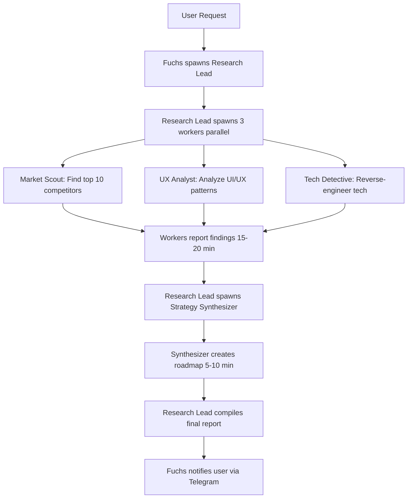
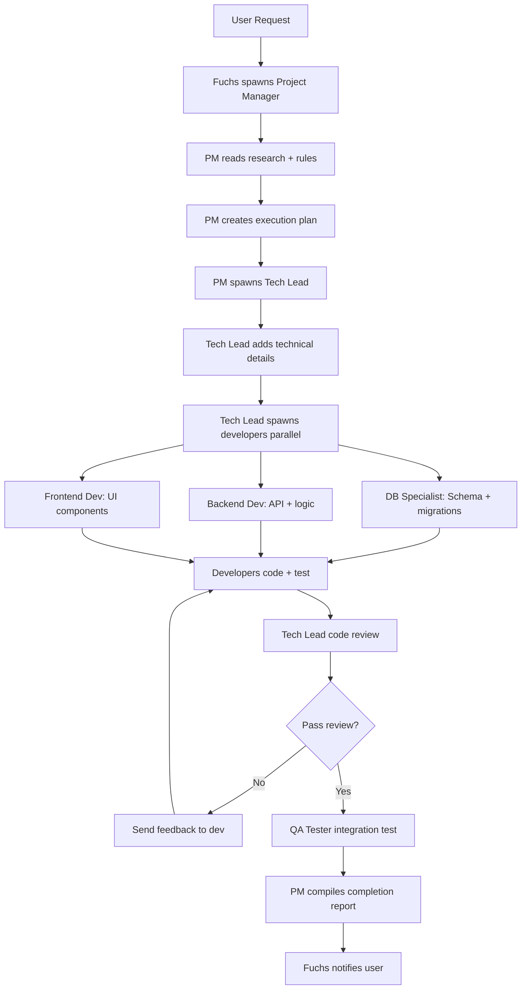
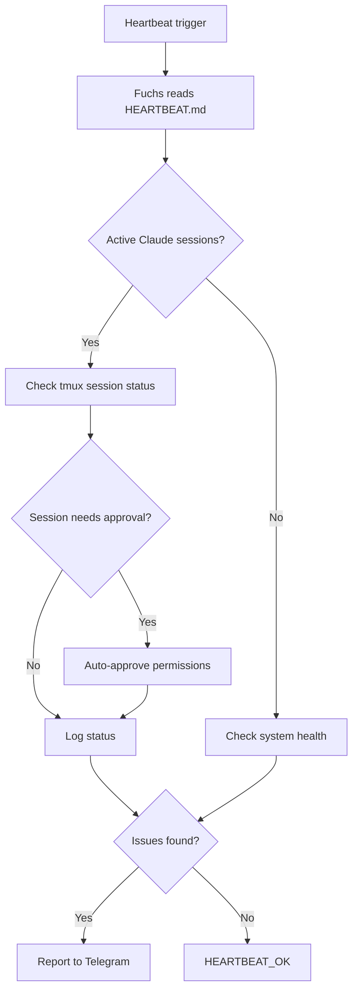

# COMPLETE WORKFLOW DOCUMENTATION - DMF E-LEARNING

*All workflows từ Research → Execution - Documented 2026-02-06*

---

## 🎯 OVERVIEW (TỔNG QUAN)

DMF E-learning giờ có **3 major workflows (quy trình chính)**:

1. **Research Workflow** - Nghiên cứu thị trường & best practices
2. **Execution Workflow** - Biến research thành code
3. **Monitoring Workflow** - Theo dõi & báo cáo (existing - đã có)

---

## 📊 WORKFLOW 1: RESEARCH (NGHIÊN CỨU)

### **Purpose (Mục đích):**
Research competitors (đối thủ) trước khi develop module mới.

### **Teams Involved (Đội Liên Quan):**
- Research Lead (Trưởng nhóm nghiên cứu) - Opus 4.5
- Market Scout (Trinh sát thị trường) - Sonnet 4
- UX Analyst (Phân tích UX) - Sonnet 4  
- Tech Detective (Thám tử công nghệ) - Sonnet 4
- Strategy Synthesizer (Tổng hợp chiến lược) - Opus 4.5

### **Activation (Kích hoạt):**
```
User: "Em research [module name] module cho DMF nhé"
Example: "Em research vocabulary module cho DMF nhé"
```

### **Process Flow (Luồng Quy Trình):**



### **Duration:** 25-40 minutes

### **Output Files:**
```
.research/
├── RESEARCH_REPORT_[module].md (main - chính)
└── [module]/
    ├── market-scout-findings.md
    ├── ux-analyst-findings.md
    ├── tech-detective-findings.md
    ├── strategy-synthesis.md
    └── screenshots/ (if browser works - nếu browser hoạt động)
```

### **Cost:** ~$12-19 per module

### **Success Example (Ví dụ thành công):**
- ✅ Vocabulary research: 14 minutes, 113.9 KB documentation, 10 competitors analyzed

---

## 🚀 WORKFLOW 2: EXECUTION (THỰC THI)

### **Purpose:**
Biến research findings thành working code (code hoạt động).

### **Teams Involved:**
- Project Manager (Quản lý dự án) - Opus 4.5
- Tech Lead (Trưởng nhóm kỹ thuật) - Opus 4.5
- Database Specialist (Chuyên gia database) - Sonnet 4
- Backend Developer (Lập trình viên backend) - Sonnet 4
- Frontend Developer (Lập trình viên frontend) - Sonnet 4
- QA Tester (Người kiểm thử) - Sonnet 4

### **Activation:**
```
User: "Em execute feature [feature name] theo research findings nhé"
Example: "Em execute feature SRS Algorithm theo research findings nhé"
```

### **Process Flow:**



### **Duration:** 1-3 days per feature (depending on complexity - tùy độ phức tạp)

### **Phases:**

**Phase 1: Planning (1-2 hours)**
- PM reads research + action plan + rules
- Breaks into mini tasks (<4 hours each)
- Assigns owners (Database, Backend, Frontend)
- Creates `.execution/EXECUTION_PLAN_[feature].md`

**Phase 2: Development (Parallel - Song song)**
- DB Specialist: Schema design + migrations
- Backend Dev: APIs + business logic + tests
- Frontend Dev: Components + integration + tests
- Each follows `.claude/rules/[domain].md`

**Phase 3: Review & Integration**
- Tech Lead reviews all code
- Checks: rules compliance, tests, performance, security
- Integrates all pieces
- End-to-end testing

**Phase 4: QA & Delivery**
- QA runs full test suite (bộ test đầy đủ)
- Finds edge cases + bugs
- PM generates completion report
- Fuchs delivers to user

### **Output Files:**
```
.execution/
├── EXECUTION_PLAN_[feature].md
├── TASKS_[feature].md
├── DAILY_STANDUP_YYYY-MM-DD.md
├── COMPLETION_REPORT_[feature].md
└── workflows/
    ├── WORKFLOW_RESEARCH_TO_CODE.md (this file)
    └── WORKFLOW_FEATURE_DELIVERY.md

dmf-elearning-platform/
├── [code changes in actual codebase]
├── [tests]
└── [documentation updates]
```

### **Cost:** ~$50-200 per feature (varies by complexity - thay đổi theo độ phức tạp)

---

## 🔄 WORKFLOW 3: MONITORING (GIÁM SÁT)

### **Purpose:**
Track system health (sức khỏe hệ thống), Claude sessions, cron jobs.

### **Teams Involved:**
- Fuchs (main agent - agent chính)
- Monitor sessions (if spawned - nếu tạo)

### **Activation:**
Automatic via HEARTBEAT.md (every 5-10 min)

### **Process Flow:**



### **Checks:**
- Claude Code tmux sessions (if active)
- System health (disk, memory, CPU)
- Cron job status
- Gateway uptime

### **Output:**
- Telegram notifications (when issues - khi vấn đề)
- HEARTBEAT_OK (when normal - khi bình thường)

---

## 🔗 INTEGRATED WORKFLOW (QUY TRÌNH TÍCH HỢP)

### **Full Development Cycle (Chu kỳ phát triển đầy đủ):**

```
1. RESEARCH
   ↓
   User: "Em research vocabulary nhé"
   ↓
   [Research Team works 25-40 min]
   ↓
   Output: .research/RESEARCH_REPORT_vocabulary.md
   
2. PLANNING
   ↓
   Fuchs: Reads research → Creates DMF_VOCABULARY_ACTION_PLAN.md
   ↓
   Output: Actionable plan với priorities (ưu tiên)
   
3. EXECUTION
   ↓
   User: "Em execute feature SRS Algorithm nhé"
   ↓
   [Execution Team works 1-3 days]
   ↓
   Output: Working code + tests + docs
   
4. MONITORING
   ↓
   [Ongoing - Đang diễn ra]
   ↓
   Fuchs monitors health, reports issues
```

---

## 📁 COMPLETE FILE STRUCTURE (CẤU TRÚC FILE HOÀN CHỈNH)

```
dmf-elearning-platform/
├── .research/                          # Research Team output
│   ├── README.md                       # Research team guide
│   ├── RESEARCH_REPORT_vocabulary.md
│   └── vocabulary/
│       ├── market-scout-findings.md
│       ├── ux-analyst-findings.md
│       ├── tech-detective-findings.md
│       ├── strategy-synthesis.md
│       └── screenshots/
│
├── .execution/                         # Execution Team workspace
│   ├── EXECUTION_TEAM.md              # Team overview
│   ├── EXECUTION_PLAN_[feature].md
│   ├── TASKS_[feature].md
│   ├── DAILY_STANDUP_YYYY-MM-DD.md
│   ├── COMPLETION_REPORT_[feature].md
│   └── workflows/
│       ├── WORKFLOW_COMPLETE.md (this file)
│       └── WORKFLOW_FEATURE_DELIVERY.md
│
├── .claude/
│   ├── settings.json                   # Permissions + hooks
│   ├── commands/
│   │   ├── commit.md
│   │   ├── test.md
│   │   ├── description.md
│   │   └── research.md                # Research trigger
│   ├── rules/                          # Development rules
│   │   ├── api-backend.md
│   │   ├── frontend-react.md
│   │   ├── database-prisma.md
│   │   ├── testing.md
│   │   └── security.md
│   └── agents/
│       ├── research-lead.md           # Research team
│       ├── market-scout.md
│       ├── ux-analyst.md
│       ├── tech-detective.md
│       ├── strategy-synthesizer.md
│       ├── project-manager.md         # Execution team
│       ├── tech-lead.md
│       ├── database-specialist.md
│       ├── backend-developer.md
│       ├── frontend-developer.md
│       └── qa-tester.md
│
├── [DMF codebase - apps/, services/, prisma/]
│
└── AI_RESEARCH_TEAM.md                 # Research team design doc
    DMF_VOCABULARY_ACTION_PLAN.md       # Action plan from research
    IMPLEMENTATION_GUIDE.md             # Claude Code setup guide
```

---

## 📊 TEAM ROSTER (DANH SÁCH ĐỘI)

### **Research Team (5 agents):**
| Agent | Model | Role | Duration |
|-------|-------|------|----------|
| Research Lead | Opus 4.5 | Coordination (Phối hợp) | 10 min |
| Market Scout | Sonnet 4 | Find competitors (Tìm đối thủ) | 15 min |
| UX Analyst | Sonnet 4 | UI/UX patterns (Mẫu UI/UX) | 15 min |
| Tech Detective | Sonnet 4 | Tech stacks (Công nghệ) | 15 min |
| Strategy Synthesizer | Opus 4.5 | Roadmap (Lộ trình) | 10 min |

### **Execution Team (6 agents):**
| Agent | Model | Role | Duration |
|-------|-------|------|----------|
| Project Manager | Opus 4.5 | Planning (Lập kế hoạch) | 2 hours |
| Tech Lead | Opus 4.5 | Review + coordination | Ongoing |
| DB Specialist | Sonnet 4 | Schema + migrations | 2-4 hours |
| Backend Dev | Sonnet 4 | APIs + logic | 4-8 hours |
| Frontend Dev | Sonnet 4 | UI components | 4-8 hours |
| QA Tester | Sonnet 4 | Testing | 2-4 hours |

---

## ✅ SUCCESS METRICS (CHỈ SỐ THÀNH CÔNG)

### **Research Workflow:**
- ✅ Report delivered <40 min
- ✅ ≥5 competitors analyzed
- ✅ ≥3 UX patterns documented
- ✅ Tech stacks fully analyzed
- ✅ Implementation roadmap clear

### **Execution Workflow:**
- ✅ Code follows rules (tuân theo luật)
- ✅ >80% test coverage (độ phủ test)
- ✅ All tasks complete (tất cả tasks hoàn thành)
- ✅ QA approved (QA chấp thuận)
- ✅ Documentation updated (tài liệu cập nhật)

---

## 🎯 NEXT ACTIONS (HÀNH ĐỘNG TIẾP THEO)

**For User (Cho User):**
1. Try research workflow (Thử quy trình nghiên cứu): `/research vocabulary` trong Claude Code
2. Try execution workflow (Thử quy trình thực thi): "Em execute feature SRS Algorithm nhé"
3. Monitor progress (Giám sát tiến độ) via Telegram notifications

**For Fuchs (Cho Fuchs):**
1. Save this workflow to memory (Lưu quy trình này vào memory)
2. Update TEAM.md với Execution Team (Cập nhật TEAM.md với Đội Thực Thi)
3. Ready to activate workflows when requested (Sẵn sàng kích hoạt quy trình khi yêu cầu)

---

**Created by (Được tạo bởi):** Fuchs 🦊  
**Date:** 2026-02-06  
**Status:** ✅ COMPLETE - All workflows documented (HOÀN THÀNH - Tất cả quy trình đã ghi chép)

