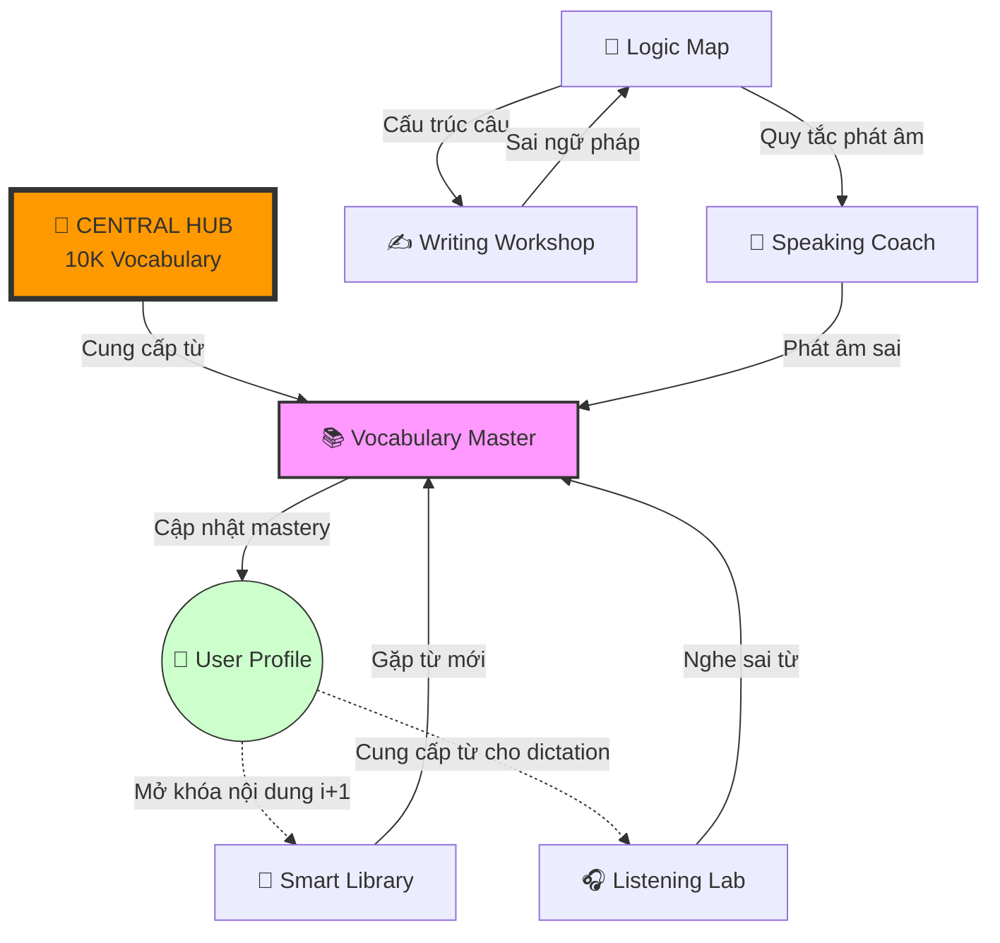

# DMF German E-Learning Platform - MASTER PLAN

## Version 2.0 - "THE CENTRAL HUB" Architecture

**Cập nhật:** 2026-02-03
**Trạng thái:** Active Development
**Mục tiêu:** Nền tảng học tiếng Đức toàn diện với 6 hệ thống kỹ năng độc lập

---

## 1. TỔNG QUAN KIẾN TRÚC

### 1.1 Mô hình "Central Hub" (Trục Xoay Trung Tâm)

```
                    ┌──────────────────────────────────────┐
                    │     🎯 CENTRAL HUB - 10K VOCABULARY  │
                    │  ┌────────────────────────────────┐  │
                    │  │ word, level (A1-C2), topic,    │  │
                    │  │ pos, meaning_vi, example_de/vi,│  │
                    │  │ audio_url, family_words[],     │  │
                    │  │ grammar_tags[], phonetic_ipa   │  │
                    │  └────────────────────────────────┘  │
                    └──────────────────────────────────────┘
                                      │
                    ┌─────────────────┴─────────────────┐
                    │      👤 USER LEARNING PROFILE     │
                    │  word_mastery, skill_progress,    │
                    │  SRS_schedule, weak_points,       │
                    │  learning_preferences             │
                    └─────────────────┬─────────────────┘
                                      │
        ┌──────────┬──────────┬───────┴───────┬──────────┬──────────┐
        ▼          ▼          ▼               ▼          ▼          ▼
   ┌─────────┐ ┌─────────┐ ┌─────────┐ ┌─────────┐ ┌─────────┐ ┌─────────┐
   │📚 VOCAB │ │📖 READ  │ │🎧 LISTEN│ │✍️ WRITE │ │🎤 SPEAK │ │🧠 GRAMMAR│
   │ MASTER  │ │ LIBRARY │ │   LAB   │ │WORKSHOP │ │  COACH  │ │LOGIC MAP│
   └────┬────┘ └────┬────┘ └────┬────┘ └────┬────┘ └────┬────┘ └────┬────┘
        │          │          │           │          │          │
        └──────────┴──────────┴─────┬─────┴──────────┴──────────┘
                                    ▼
                           ┌───────────────┐
                           │ 🔄 FEEDBACK   │
                           │    LOOP       │
                           └───────────────┘
```

### 1.2 Nguyên lý hoạt động

| Thành phần | Vai trò |
|------------|---------|
| **Central Hub** | Kho 10,004 từ vựng làm nguồn dữ liệu chung |
| **User Profile** | Theo dõi tiến độ, điểm yếu, lịch ôn tập của từng người |
| **6 Skill Systems** | Hoạt động độc lập, dùng chung dữ liệu từ Hub |
| **Feedback Loop** | Lỗi ở hệ thống nào → đẩy về Hub/hệ thống tương ứng để học lại |

---

## 2. CHI TIẾT 6 HỆ THỐNG

### 2.1 📚 VOCABULARY MASTER - "Từ Điển Sống"

**Mục tiêu:** Nạp nguyên liệu thô vào bộ nhớ dài hạn

**Cơ chế:** Spaced Repetition System (SM-2 Algorithm)

#### Cấu trúc bài học:

```
┌─────────────────────────────────────────────────────────────┐
│                    VOCABULARY CARD                          │
├─────────────────────────────────────────────────────────────┤
│  🔤 Từ vựng:     der Lehrer                                 │
│  🔊 Phát âm:     [ˈleːʁɐ] (Audio button)                    │
│  📝 Nghĩa:       giáo viên (nam)                            │
│  📖 Ví dụ:       Der Lehrer erklärt die Grammatik.          │
│                  (Giáo viên giải thích ngữ pháp.)           │
│  🌳 Gốc từ:      lehren (dạy) → Lehrer (người dạy)          │
│  👨‍👩‍👧 Family:     die Lehrerin, die Schule, lernen, der Schüler │
├─────────────────────────────────────────────────────────────┤
│  📊 Word Meter:  [████████░░] 80% - Đã nhớ                  │
└─────────────────────────────────────────────────────────────┘
```

#### Tính năng:

| Feature | Mô tả |
|---------|-------|
| **Flashcard 2 chiều** | Đức → Việt, Việt → Đức |
| **Spelling Test** | Gõ lại từ để kiểm tra chính tả |
| **Family Words** | Hiển thị các từ liên quan cùng gốc |
| **Word Meter** | Thanh tiến độ: Mới → Đang học → Đã nhớ → Thành thạo |
| **SRS Schedule** | Tự động nhắc ôn theo thuật toán SM-2 |

#### Database Schema:

```sql
-- User word progress (SRS)
CREATE TABLE user_word_progress (
  id UUID PRIMARY KEY DEFAULT gen_random_uuid(),
  user_id UUID REFERENCES users(id),
  word_id UUID REFERENCES vocabulary_items(id),

  -- SM-2 Algorithm fields
  ease_factor FLOAT DEFAULT 2.5,
  interval_days INT DEFAULT 1,
  repetitions INT DEFAULT 0,
  next_review TIMESTAMP,

  -- Status tracking
  status VARCHAR(20) DEFAULT 'new', -- new, learning, review, mastered
  last_result BOOLEAN,
  total_reviews INT DEFAULT 0,
  correct_reviews INT DEFAULT 0,

  created_at TIMESTAMP DEFAULT NOW(),
  updated_at TIMESTAMP DEFAULT NOW(),

  UNIQUE(user_id, word_id)
);

-- Word families
CREATE TABLE word_families (
  id UUID PRIMARY KEY,
  root_word VARCHAR(100),
  family_members UUID[] -- array of vocabulary_item ids
);
```

---

### 2.2 📖 SMART LIBRARY - "Thư Viện Thông Minh"

**Mục tiêu:** Đọc hiểu với nội dung phù hợp trình độ

**Nguyên lý:** i+1 (Comprehensible Input - Krashen)

#### Cơ chế hoạt động:

```
┌─────────────────────────────────────────────────────────────┐
│  📊 Phân tích văn bản                                       │
├─────────────────────────────────────────────────────────────┤
│  Tổng số từ: 200                                            │
│  Từ đã biết: 170 (85%) ✅                                   │
│  Từ mới: 30 (15%)                                           │
│  → Độ khó: PHÙ HỢP (i+1)                                    │
└─────────────────────────────────────────────────────────────┘
```

#### Tính năng:

| Feature | Mô tả |
|---------|-------|
| **i+1 Filtering** | Chỉ hiển thị bài đọc có 80-90% từ đã biết |
| **Pop-up Dictionary** | Click từ → hiện nghĩa + thêm vào danh sách học |
| **Speed Reading** | Công cụ cuộn văn bản để luyện tốc độ |
| **Highlight Unknown** | Tô màu các từ chưa biết |
| **Reading Stats** | Thống kê tốc độ đọc, số từ mới học được |

#### Content Sources:

```
1. AI-Generated (Claude API):
   - Graded readers theo level A1-C2
   - Chủ đề: Đời sống, Du lịch, Công việc, Văn hóa Đức

2. External (với permission):
   - Deutsche Welle (tin tức chậm)
   - Grimm's Märchen (adapted)

3. User-Contributed:
   - Import văn bản từ người dùng
   - Tự động phân tích level
```

#### Database Schema:

```sql
CREATE TABLE reading_materials (
  id UUID PRIMARY KEY,
  title TEXT NOT NULL,
  content TEXT NOT NULL,
  level VARCHAR(2), -- A1, A2, B1, B2, C1, C2
  topic VARCHAR(100),
  word_count INT,
  word_ids UUID[], -- từ vựng trong bài
  audio_url TEXT, -- optional audio version
  source VARCHAR(50), -- 'ai_generated', 'external', 'user'
  created_at TIMESTAMP DEFAULT NOW()
);

CREATE TABLE user_reading_progress (
  user_id UUID REFERENCES users(id),
  material_id UUID REFERENCES reading_materials(id),
  words_learned UUID[], -- từ mới học được từ bài này
  completion_percent FLOAT,
  reading_time_seconds INT,
  finished_at TIMESTAMP,
  PRIMARY KEY (user_id, material_id)
);
```

---

### 2.3 🎧 LISTENING LAB - "Phòng Lab Thính Giác"

**Mục tiêu:** Phát triển khả năng nghe hiểu

#### Phân hệ 1: Nghe thụ động (Immersion)

```
┌─────────────────────────────────────────────────────────────┐
│  🎵 IMMERSION PLAYLIST                                      │
├─────────────────────────────────────────────────────────────┤
│  Dựa trên từ vựng bạn đã học:                               │
│                                                             │
│  ▶️ Podcast: "Ein Tag in Berlin" (A2)                       │
│     Chứa 45 từ bạn đã biết                                  │
│                                                             │
│  ▶️ News: "Deutsche Welle Langsam" (B1)                     │
│     Chứa 67 từ bạn đã biết                                  │
└─────────────────────────────────────────────────────────────┘
```

#### Phân hệ 2: Nghe chủ động (Dictation)

```
┌─────────────────────────────────────────────────────────────┐
│  ✍️ DICTATION EXERCISE                                      │
├─────────────────────────────────────────────────────────────┤
│  🔊 [Play Audio]                                            │
│                                                             │
│  "Der Lehrer erklärt die Grammatik sehr gut."               │
│                                                             │
│  Gõ lại những gì bạn nghe:                                  │
│  ┌─────────────────────────────────────────────────────┐   │
│  │ Der Lerer erklärt die Gramatik sehr gut.           │   │
│  └─────────────────────────────────────────────────────┘   │
│                                                             │
│  ❌ Sai: "Lerer" → "Lehrer" (đẩy về Vocabulary để học lại)  │
│  ❌ Sai: "Gramatik" → "Grammatik"                           │
└─────────────────────────────────────────────────────────────┘
```

#### Tính năng:

| Feature | Mô tả |
|---------|-------|
| **TTS Integration** | Text-to-Speech chất lượng cao cho tiếng Đức |
| **Speed Control** | Điều chỉnh tốc độ: 0.5x, 0.75x, 1x, 1.25x |
| **Dictation Feedback** | So sánh real-time, highlight lỗi |
| **Error → Vocab Loop** | Từ nghe sai tự động thêm vào hàng đợi ôn tập |
| **Sentence Bank** | Kho câu từ 10K vocab database |

#### Technology Stack:

```
TTS Options:
├── Google Cloud Text-to-Speech (de-DE voices)
├── Azure Cognitive Services Speech
└── ElevenLabs (premium quality)

Audio Processing:
├── Web Audio API
└── Howler.js for playback
```

---

### 2.4 ✍️ WRITING WORKSHOP - "Xưởng Cấu Trúc"

**Mục tiêu:** Sản xuất văn bản đúng ngữ pháp

#### Cấp độ 1: Sentence Building

```
┌─────────────────────────────────────────────────────────────┐
│  🧩 SẮP XẾP CÂU                                             │
├─────────────────────────────────────────────────────────────┤
│  Kéo thả các từ để tạo câu đúng:                            │
│                                                             │
│  [gut] [erklärt] [Grammatik] [die] [Der] [Lehrer]          │
│                                                             │
│  Câu của bạn:                                               │
│  ┌─────────────────────────────────────────────────────┐   │
│  │ Der Lehrer erklärt die Grammatik gut.              │   │
│  └─────────────────────────────────────────────────────┘   │
│  ✅ Chính xác!                                              │
└─────────────────────────────────────────────────────────────┘
```

#### Cấp độ 2: Error Correction

```
┌─────────────────────────────────────────────────────────────┐
│  🔧 SỬA LỖI                                                 │
├─────────────────────────────────────────────────────────────┤
│  Tìm và sửa lỗi trong câu sau:                              │
│                                                             │
│  "Ich gehe in der Schule."                                  │
│                                                             │
│  ┌─────────────────────────────────────────────────────┐   │
│  │ Ich gehe in die Schule.                            │   │
│  └─────────────────────────────────────────────────────┘   │
│                                                             │
│  ✅ Đúng! Giải thích:                                       │
│  "gehen" + Akkusativ (chỉ hướng đi đến)                    │
│  → "die Schule" thay vì "der Schule"                       │
└─────────────────────────────────────────────────────────────┘
```

#### Cấp độ 3: Guided Writing

```
┌─────────────────────────────────────────────────────────────┐
│  📝 VIẾT TỰ DO                                              │
├─────────────────────────────────────────────────────────────┤
│  Chủ đề: "Mô tả ngày của bạn"                               │
│  Từ bắt buộc: aufstehen, frühstücken, arbeiten, schlafen   │
│                                                             │
│  ┌─────────────────────────────────────────────────────┐   │
│  │ Ich stehe um 7 Uhr auf. Dann frühstücke ich...     │   │
│  │                                                     │   │
│  └─────────────────────────────────────────────────────┘   │
│                                                             │
│  🤖 AI Feedback:                                            │
│  ✅ Ngữ pháp: Đúng                                          │
│  💡 Gợi ý: "Danach" thay vì "Dann" để đa dạng hơn          │
└─────────────────────────────────────────────────────────────┘
```

#### Technology:

```
AI Grammar Check:
├── Claude API (đã tích hợp)
├── Custom prompts cho German grammar
└── Error classification & explanation
```

---

### 2.5 🎤 SPEAKING COACH - "Huấn Luyện Viên Ảo"

**Mục tiêu:** Luyện phát âm và phản xạ nói

#### Cấp độ 1: Phonology (Âm vị)

```
┌─────────────────────────────────────────────────────────────┐
│  🔤 LUYỆN ÂM KHÓ                                            │
├─────────────────────────────────────────────────────────────┤
│  Âm: "ch" [ç] như trong "ich"                               │
│                                                             │
│  🔊 Nghe mẫu: [Play]                                        │
│  📍 Vị trí lưỡi: [Hình minh họa]                            │
│                                                             │
│  Từ luyện tập:                                              │
│  • ich [ɪç]                                                 │
│  • nicht [nɪçt]                                             │
│  • möchte [ˈmœçtə]                                          │
│                                                             │
│  🎤 [Thu âm] → So sánh với mẫu                              │
└─────────────────────────────────────────────────────────────┘
```

#### Cấp độ 2: Shadowing

```
┌─────────────────────────────────────────────────────────────┐
│  🎭 SHADOWING                                               │
├─────────────────────────────────────────────────────────────┤
│  🔊 Native: "Guten Morgen! Wie geht es Ihnen?"              │
│                                                             │
│  🎤 Your recording: [Waveform visualization]                │
│                                                             │
│  📊 Analysis:                                               │
│  ├── Accuracy: 85%                                          │
│  ├── Intonation: 78%                                        │
│  └── Speed: 92%                                             │
│                                                             │
│  ⚠️ Cần cải thiện: "Ihnen" - âm "I" cần dài hơn            │
└─────────────────────────────────────────────────────────────┘
```

#### Cấp độ 3: Reflex (Phản xạ 3 giây)

```
┌─────────────────────────────────────────────────────────────┐
│  ⚡ PHẢN XẠ NHANH                                           │
├─────────────────────────────────────────────────────────────┤
│  ❓ "Wie heißen Sie?"                                       │
│                                                             │
│  ⏱️ [3...2...1...]                                          │
│                                                             │
│  🎤 [Recording...]                                          │
│                                                             │
│  ✅ "Ich heiße Anna." - Phản xạ tốt!                        │
└─────────────────────────────────────────────────────────────┘
```

#### Technology Stack:

```
Speech Recognition:
├── OpenAI Whisper (local or API)
├── Azure Speech Services
└── Web Speech API (fallback)

Pronunciation Analysis:
├── Phoneme alignment
├── Pitch contour comparison
└── Custom scoring algorithm
```

---

### 2.6 🧠 LOGIC MAP - "Bản Đồ Tư Duy"

**Mục tiêu:** Học ngữ pháp như khoa học logic

**Phương pháp:** Visual Learning + Flowcharts

#### Ví dụ: Adjektivdeklination (Chia đuôi tính từ)

```
┌─────────────────────────────────────────────────────────────┐
│  📊 FLOWCHART: ĐUÔI TÍNH TỪ                                 │
├─────────────────────────────────────────────────────────────┤
│                                                             │
│  Có quán từ xác định (der/die/das)?                         │
│           │                                                 │
│     ┌─────┴─────┐                                           │
│     ▼           ▼                                           │
│    CÓ         KHÔNG                                         │
│     │           │                                           │
│     ▼           ▼                                           │
│  Đuôi -e    Đuôi mạnh                                       │
│  (hầu hết)  (như quán từ)                                   │
│     │           │                                           │
│     ▼           ▼                                           │
│  der große   großer Mann                                    │
│  Mann        (Nom. mask.)                                   │
│                                                             │
└─────────────────────────────────────────────────────────────┘
```

#### Cấu trúc nội dung:

```
GRAMMAR TOPICS:
├── A1 Level
│   ├── Artikel (der, die, das)
│   ├── Personalpronomen
│   ├── Präsens (hiện tại)
│   ├── Satzstellung (V2)
│   └── Ja/Nein Fragen
│
├── A2 Level
│   ├── Perfekt
│   ├── Modalverben
│   ├── Akkusativ/Dativ
│   ├── Präpositionen
│   └── Nebensätze (weil, dass)
│
├── B1 Level
│   ├── Präteritum
│   ├── Passiv
│   ├── Konjunktiv II
│   ├── Relativsätze
│   └── Indirekte Rede
│
└── B2+ Level
    ├── Konjunktiv I
    ├── Partizipialkonstruktionen
    └── Nominalisierung
```

#### Database Schema:

```sql
CREATE TABLE grammar_rules (
  id UUID PRIMARY KEY,
  topic VARCHAR(100) NOT NULL,
  level VARCHAR(2) NOT NULL,
  title_de TEXT,
  title_vi TEXT,
  explanation_vi TEXT,
  visual_diagram TEXT, -- SVG or Mermaid syntax
  examples JSONB, -- [{de: "...", vi: "..."}]
  common_errors JSONB,
  related_words UUID[], -- từ vựng liên quan
  prerequisite_rules UUID[], -- rules cần học trước
  created_at TIMESTAMP DEFAULT NOW()
);

CREATE TABLE grammar_exercises (
  id UUID PRIMARY KEY,
  rule_id UUID REFERENCES grammar_rules(id),
  type VARCHAR(50), -- 'fill_blank', 'multiple_choice', 'transform'
  question JSONB,
  correct_answer TEXT,
  explanation TEXT,
  difficulty INT -- 1-5
);
```

---

## 3. DATA FLOW & FEEDBACK LOOPS

### 3.1 Sơ đồ luồng dữ liệu



### 3.2 Feedback Loop Rules

| Nguồn lỗi | Hành động | Đích |
|-----------|-----------|------|
| Reading: click từ chưa biết | Thêm vào learning queue | Vocabulary Master |
| Listening: dictation sai từ | Reset SRS interval về 1 | Vocabulary Master |
| Writing: lỗi ngữ pháp | Gợi ý rule tương ứng | Logic Map |
| Speaking: phát âm sai | Thêm vào phonetic drill | Speaking Coach |

---

## 4. GAMIFICATION SYSTEM

### 4.1 Achievements per System

| Hệ thống | Huy hiệu | Điều kiện |
|----------|----------|-----------|
| **Vocabulary** | 🏆 Thánh Từ Vựng | Master 5000 từ |
| **Reading** | 📚 Mọt Sách | Đọc 100 bài |
| **Listening** | 👂 Tai Vàng | 1000 câu dictation đúng |
| **Writing** | ✍️ Bàn Tay Thép | Viết 500 câu không lỗi |
| **Speaking** | 🎤 Giọng Chuẩn | 90% accuracy shadowing |
| **Grammar** | 🧠 Logic Master | Hoàn thành tất cả B2 rules |

### 4.2 Leaderboards

```
┌─────────────────────────────────────────────────────────────┐
│  🏆 BẢNG XẾP HẠNG TUẦN                                      │
├─────────────────────────────────────────────────────────────┤
│  📚 Vocabulary:        🎧 Listening:        ✍️ Writing:     │
│  1. Anna - 500 từ      1. Max - 200 câu     1. Linh - 50    │
│  2. Minh - 420 từ      2. Anna - 180 câu    2. Anna - 45    │
│  3. Hoa - 380 từ       3. Hoa - 150 câu     3. Max - 40     │
└─────────────────────────────────────────────────────────────┘
```

---

## 5. TECHNOLOGY STACK

### 5.1 Core Technologies

| Component | Technology | Status |
|-----------|------------|--------|
| **Frontend** | Next.js 14 + TailwindCSS + shadcn/ui | ✅ Done |
| **Backend** | Node.js + Express | ✅ Done |
| **Database** | PostgreSQL | ✅ Done |
| **AI/NLP** | Claude API (Anthropic) | ✅ Done |
| **Local AI** | Ollama (Llama 3.2) | ✅ Done |
| **TTS** | Google Cloud TTS / ElevenLabs | 📋 Planned |
| **ASR** | OpenAI Whisper | 📋 Planned |
| **Audio** | Web Audio API + Howler.js | 📋 Planned |

### 5.2 Microservices Architecture

```
┌─────────────────────────────────────────────────────────────┐
│                     API Gateway                              │
└─────────────────────────────────────────────────────────────┘
        │           │           │           │           │
        ▼           ▼           ▼           ▼           ▼
┌─────────────┐ ┌─────────┐ ┌─────────┐ ┌─────────┐ ┌─────────┐
│   User      │ │Learning │ │ Content │ │Gamifica-│ │   AI    │
│  Service    │ │ Service │ │ Service │ │  tion   │ │ Service │
└─────────────┘ └─────────┘ └─────────┘ └─────────┘ └─────────┘
        │           │           │           │           │
        └───────────┴───────────┴───────────┴───────────┘
                              │
                    ┌─────────────────┐
                    │   PostgreSQL    │
                    │   (10K Vocab)   │
                    └─────────────────┘
```

---

## 6. IMPLEMENTATION ROADMAP

### Phase 1: Vocabulary Master Enhancement (Current → +2 weeks)

**Status:** 🚧 In Progress

| Task | Priority | Status |
|------|----------|--------|
| Implement SM-2 SRS algorithm | P0 | 📋 TODO |
| Add Family Words linking | P0 | 📋 TODO |
| Add Word Meter UI component | P1 | 📋 TODO |
| Integrate TTS for audio | P1 | 📋 TODO |
| Flashcard 2-way mode | P0 | 📋 TODO |
| Review queue scheduling | P0 | 📋 TODO |

### Phase 2: Smart Library (+2 weeks)

**Status:** 📋 Planned

| Task | Priority |
|------|----------|
| i+1 content recommendation algorithm | P0 |
| AI-generated graded readers | P0 |
| Pop-up dictionary component | P1 |
| Speed reading tool | P2 |
| Reading progress tracking | P1 |

### Phase 3: Listening Lab (+3 weeks)

**Status:** 📋 Planned

| Task | Priority |
|------|----------|
| TTS integration (German voices) | P0 |
| Dictation exercise engine | P0 |
| Audio speed control | P1 |
| Error → Vocabulary feedback loop | P0 |
| Immersion playlist generator | P2 |

### Phase 4: Writing Workshop (+2 weeks)

**Status:** 📋 Planned

| Task | Priority |
|------|----------|
| Sentence building (drag & drop) | P0 |
| Error correction exercises | P0 |
| AI grammar checking integration | P0 |
| Guided writing prompts | P1 |

### Phase 5: Speaking Coach (+4 weeks)

**Status:** 📋 Planned

| Task | Priority |
|------|----------|
| IPA phoneme training module | P1 |
| Shadowing with TTS | P0 |
| Recording & playback | P0 |
| Speech recognition integration | P0 |
| Pronunciation scoring | P1 |

### Phase 6: Logic Map (Parallel development)

**Status:** 📋 Planned

| Task | Priority |
|------|----------|
| Grammar content creation (A1-B2) | P0 |
| Visual flowchart diagrams | P1 |
| Interactive exercises | P0 |
| Grammar → Other systems linking | P2 |

---

## 7. SUCCESS METRICS

### 7.1 KPIs per System

| System | KPI | Target |
|--------|-----|--------|
| **Vocabulary** | Words mastered/user/week | 50+ |
| **Reading** | Articles read/user/week | 5+ |
| **Listening** | Dictation accuracy | 85%+ |
| **Writing** | Grammar accuracy | 80%+ |
| **Speaking** | Pronunciation score | 80%+ |
| **Grammar** | Rule completion rate | 90%+ |

### 7.2 Overall Platform

| Metric | Target |
|--------|--------|
| Daily Active Users (DAU) | 1000+ |
| Weekly Retention | 60%+ |
| Learning time/user/day | 20+ minutes |
| User satisfaction (NPS) | 50+ |

---

## 8. CURRENT STATUS

### 8.1 Completed ✅

- [x] Central Hub: 10,004 vocabulary items
- [x] Each word: level, topic, pos, meaning_vi, example_de, example_vi
- [x] Basic flashcard UI
- [x] Gamification service (XP, levels, leaderboard)
- [x] Social features (friends, challenges)
- [x] AI integration (Claude + Ollama)
- [x] User authentication & onboarding

### 8.2 In Progress 🚧

- [ ] SRS algorithm implementation
- [ ] Family words database linking
- [ ] TTS integration

### 8.3 Next Up 📋

- [ ] Smart Library (Phase 2)
- [ ] Listening Lab (Phase 3)

---

## 9. APPENDIX

### A. SM-2 Algorithm Reference

```javascript
// SM-2 Spaced Repetition Algorithm
function sm2(quality, repetitions, easeFactor, interval) {
  // quality: 0-5 (0-2: fail, 3-5: pass)

  if (quality < 3) {
    // Reset on failure
    return { repetitions: 0, interval: 1, easeFactor };
  }

  // Calculate new values
  const newEF = Math.max(1.3, easeFactor + (0.1 - (5 - quality) * (0.08 + (5 - quality) * 0.02)));

  let newInterval;
  if (repetitions === 0) {
    newInterval = 1;
  } else if (repetitions === 1) {
    newInterval = 6;
  } else {
    newInterval = Math.round(interval * newEF);
  }

  return {
    repetitions: repetitions + 1,
    interval: newInterval,
    easeFactor: newEF
  };
}
```

### B. i+1 Algorithm Reference

```javascript
// Calculate comprehension level for a text
function calculateComprehension(textWordIds, userKnownWordIds) {
  const known = textWordIds.filter(id => userKnownWordIds.includes(id));
  const percent = (known.length / textWordIds.length) * 100;

  // i+1 sweet spot: 80-90% known
  return {
    knownPercent: percent,
    isOptimal: percent >= 80 && percent <= 90,
    newWords: textWordIds.filter(id => !userKnownWordIds.includes(id))
  };
}
```

---

**Last Updated:** 2026-02-03
**Version:** 2.0
**Maintainer:** DMF Team
