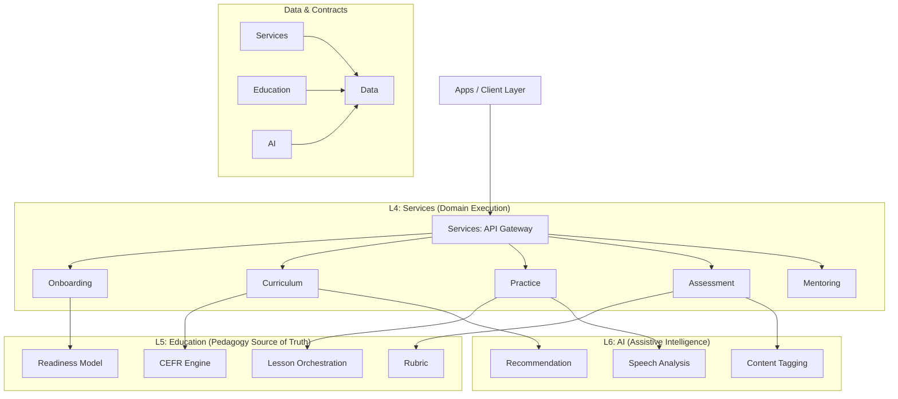

# DMF Module Map & Responsibilities

 **Strict Architectural Definition**
 This document defines the bounding boxes for all system modules.
 It serves as the source of truth for "What goes where?".

## 1. High-Level Dependency Graph

Dependencies must ALWAYS flow downwards or inwards.

---

## 2. Module Breakdown

### A. Services Layer (`services/`)
*Transactional, user-facing boundaries.*

#### `api-gateway`
*   **Responsibility**: Entry point, routing, rate limiting, request validation.
*   **Calls**: All other Services.
*   **MUST NOT**: Contain any business logic or direct database access.

#### `onboarding`
*   **Responsibility**: User registration, profile management, subscription status.
*   **Calls**: `education/readiness-model`.
*   **MUST NOT**: Manage course progress or grades.

#### `curriculum`
*   **Responsibility**: Storing the map of Units/Lessons, tracking user unlocks & progress.
*   **Calls**: `education/cefr-engine`, `ai/recommendation`, `ai/spaced-repetition`.
*   **MUST NOT**: Evaluate the quality of a user's answer.

#### `practice`
*   **Responsibility**: Executing a lesson session. Serving exercises, accepting inputs.
*   **Calls**: `education/lesson-orchestration`, `ai/speech-analysis`.
*   **MUST NOT**: define what a "B1 Level" lesson looks like (that is `education`'s job).

#### `assessment`
*   **Responsibility**: Formal testing (Quizzes, Exams).
*   **Calls**: `education/rubric`, `education/feedback-workflow`.
*   **MUST NOT**: hallucinate scores.

---

### B. Education Layer (`education/`)
*The "Brain" of the platform. Authoritative source of pedagogy.*

#### `cefr-engine`
*   **Responsibility**: Defining strict rules for A1-C2 levels. Validates if content matches a level.
*   **Calls**: `data/content`.
*   **MUST NOT**: Handle user sessions or HTTP requests directly.

#### `rubric`
*   **Responsibility**: Pure logic for scoring. "If mistakes > 3 then Score = 70%".
*   **Calls**: None (Pure component).
*   **MUST NOT**: Depend on user identity.

#### `readiness-model`
*   **Responsibility**: Determining if a user is ready for the next level.
*   **Calls**: `services/assessment` (read-only data).
*   **MUST NOT**: Modify user data directly.

---

### C. AI Layer (`ai/`)
*The "Assistant". Probabilistic and non-authoritative.*

> [!IMPORTANT]
> **AI Rule**: AI modules provide **signals**, not decisions.
> A Service or Education module must always finalize the transaction.

#### `speech-analysis`
*   **Responsibility**: Transcribing audio, detecting pronunciation errors.
*   **Output**: Confidence scores, phoneme maps.
*   **MUST NOT**: Assign a final grade (that is `education/rubric`'s job).

#### `recommendation`
*   **Responsibility**: Suggesting the next lesson based on history.
*   **Calls**: `data/analytics`.
*   **MUST NOT**: Unlock locked content.

---

## 3. Data Flow Example: "Onboarding -> Readiness"

A user joins and determines their starting level.

1.  **User Action**: Learner signs up via `apps/web-learner`.
2.  **Service**: `services/api-gateway` routes to `services/onboarding`.
3.  **Process**:
    *   `onboarding` creates User Profile.
    *   `onboarding` triggers "Placement Test" via `services/assessment`.
4.  **Interaction**:
    *   User submits answers (some text, some speech).
    *   `services/assessment` sends audio to `ai/speech-analysis`.
    *   `ai/speech-analysis` returns `{ pronunciation_score: 0.82 }`.
5.  **Pedagogy Decision**:
    *   `services/assessment` passes raw scores + AI signals to `education/readiness-model`.
    *   `readiness-model` applies CEFR rules: "User is strong B1".
6.  **Finalization**:
    *   `services/onboarding` receives "B1" and unlocks curriculum up to B1.
    *   `services/curriculum` persists the unlock state in `data/`.
